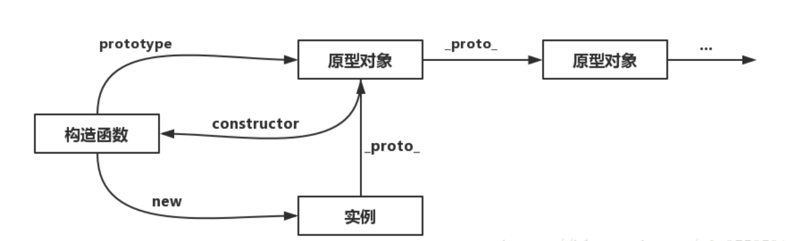

1.JavaScript：一个完整的JavaScript实现应该由下列三个不同的部分组成。


* 核心（ECMAScript）
* 文档对象模型（DOM）
* 浏览器对象模型（BOM）

2.所谓__标识符__，就是指变量、函数、属性的名字，或者函数的参数。

*  第一个字符必须是一个字母、下划线(_)或一个美元符号($);

*  其他字符可以是字母、下划线、美元符号或数字。
* 

3.​​1.const、let、var关键字区别？

- let和var的作用差不多。

区别：1.let声明的变量是块作用域，var声明的变量是函数作用域。var会有声明变量提升，let声明的变量不会在作用域中提升。

2.全局声明：使用let在全局作用域声明的变量不会成为window属性（var声明的则会成为window对象的属性）

- const行为和let基本相同。唯一重要的区别是const声明变量时，必须同时初始化变量。且尝试修改const声明的变量会导致错误。

__声明的最佳实践风格就是: 不使用var。const优先，let次之__

### 4.

**typeof 操作符：返回“object”表示返回的值为 对象 或 null；****

其他数据类型返回值一一对应。

### 5.

symbol：<span style="color:red">symbol值作为对象属性时，不能使用点运算符读取，只能用[]方括号读取。在对象的内部，使用 Symbol 值定义属性时，Symbol 值必须放在方括号之中。</span>

一个新的 API，`Reflect.ownKeys()`方法可以返回所有类型的键名，包括常规键名和 Symbol 键名。

### 6.

Array数组的indexOf、includes  vs  for-loop性能比较：

数组includes方法的性能实现原理是while循环，和indexOf（内部也是while循环）实现原理大同小异，效率差相当。都没有直接for···loop性能好，因为for···loop没有前置判断和浏览器对它的优化。

### 7、json.parse：解析字符串

### json.stringify：将对象转化为字符串

<font color="blue">深拷贝方法：json.parse(json.stringify(Obj))</font>

<font color="blue">缺点：1.不能解析 undefined;2.函数;3.无法解决循环引用的问题。</font>

<font color="deeppink">可以通过 for...in遍历对象，实现深拷贝。</font>


### 8.call\apply\bind

call就是Function.prototype.call。就是在函数的原型上写了一个方法函数叫call。他内部实现是让当前执行环境的上下文的this指向另一个指定的对象。agrs是作为当前function的参数。

function.call(obj, arg1,arg2...)

function.apply(obj,[arg1,arg2..])

function.bind(obj,arg1,arg2...)()


<span style="background:red">window ---> document ---> html --->  body --->  Element</span>

- 如果想获取 `body` 节点，方法是：`document.body`；
- 但是，如果想获取 `html`节点，方法是`document.documentElement`

<span style="color:blue">生成函数的三种方法:</span>

1.函数声明：function fun() {}

2.函数表达式：let obj = function () {}

3.构造函数：let fun = new function()

* 类数组arguments：

在调用函数时，浏览器每次都会传递进来两个隐含的参数：

1.函数的上下文对象 this

2.封装实参的对象 arguments

arguments是类数组对象，它可以通过索引来操作数据，也可以获取长度。

arguments代表的是实参。在调用函数时，我们所传递的实参都会在arguments中保存。有个讲究的地方是：arguments**只在函数中使用**。

1.(**arguments.length**)

2.**返回正在执行的函数：arguments.callee**

3.**arguments可以修改元素**

之所以说arguments是伪数组，是因为：**arguments可以修改元素，但不能改变数组的长度**

<span style="background-color:lightyellow">ES6 引入 rest 参数（形式为`...变量名`），用于获取函数的多余参数，这样就不需要使用`arguments`对象了。rest 参数搭配的变量是一个数组，该变量将多余的参数放入数组中。</span>


### 9.同源策略

<font color=blue>协议相同、域名相同、端口相同</font>

举例来说，<span style ="background:pink">`http://www.example.com/dir/page.html`</span>这个网址，<span style="background:red">协议是`http://`，域名是`www.example.com`，端口是`80`（默认端口可以省略）</span>。


rpx:是响应式开发   像素

<span style="color:deeppink">技巧：控制台  $0 可以直接获取到当前节点</span>

### 10.构造函数、原型和实例的关系

[参考链接](https://juejin.cn/post/6844903827326369799)

<span style="background-color:lightyellow">每一个构造函数   都有一个原型(prototype)。 </span>

<span style="background-color:skyblue">原型  中有一个属性指回构造函数。</span>

<span style="background-color:pink">实例  中有一个内部指针指向   原型。</span>



<font color=blue>**原型链：**原型链其实是一个链表   原型链的_ _proto_ _相当于链表的next指针</font>

<font color =red>obj._ _proto_ _ === obj.prototype</font>

<font color=red>如果一个实例的   原型中   出现过相应的  构造函数，那么instanceof 就会返回true。</font>

Object  ——> Object.prototype ——> null

function ——> Fuction.prototype  ——> Object.prototype  ——> null

arr  ——> Array.prototype  ——> Object.prototype  ——> null

String、Boolean、Number 、Symbol  的原链以此类推。

### 11.

**for...of 和for....in 区别？**

1.for..of遍历获取的是 对象键值 ，for...in遍历获取的是   对象键名

2.for..in会遍历整个对象原型链  性能非常差不推荐使用，  而for...of只遍历当前对象

3–对于数组的遍历,for … in会返回数组中所有可枚举的属性(包括原型链上可枚举的属性),for … of只返回数组的下标对应的属性值

for … of循环的原理其实也是利用了遍历对象内部的iterator接口,将for … of循环分解成最原始的for循环

### 12.

addEventListener 第三个参数是false 表示在冒泡阶段出发监听。第三个参数默认false

### 13.

数组reduce方法：

```js
//用法：arr.reduce(callback,initialValue)
callback （执行数组中每个值的函数，包含四个参数）

    1、previousValue （上一次调用回调返回的值，或者是提供的初始值（initialValue））
    2、currentValue （数组中当前被处理的元素）
    3、index （当前元素在数组中的索引）
    4、array （调用 reduce 的数组）

initialValue （作为第一次调用 callback 的第一个参数。）如果没有数组索引从1开始。有数组从0开始遍历。
```

