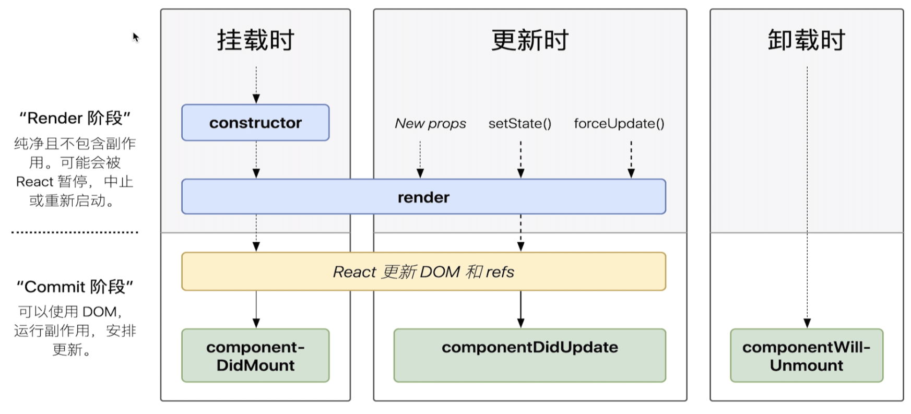
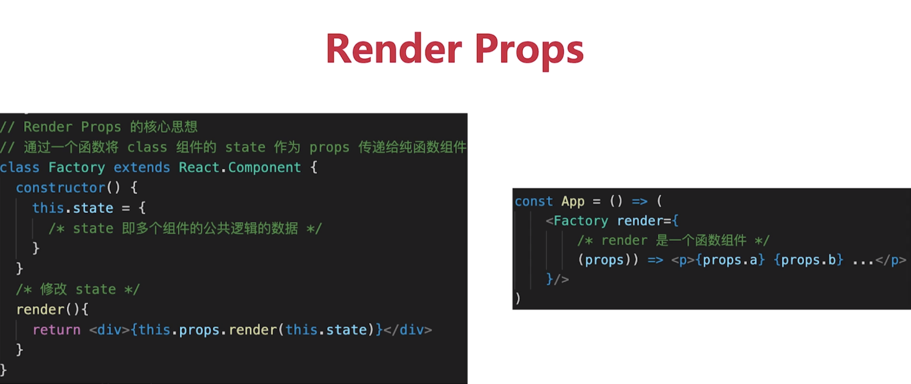
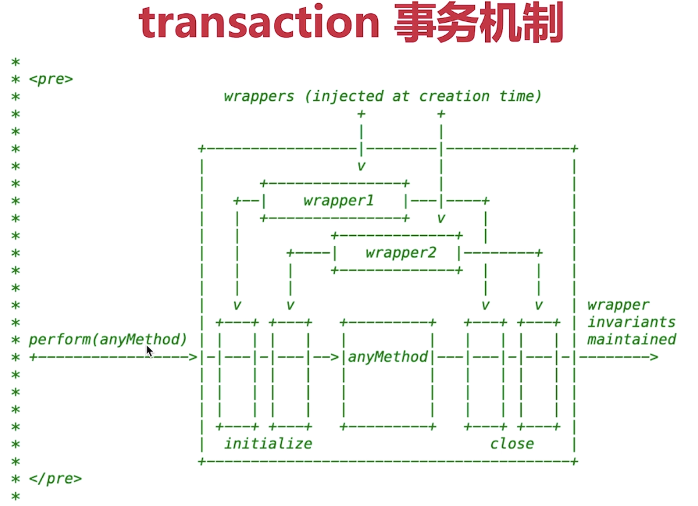

codepen.io 网站写代码

bulma.io ===>一个css库

React 是一个js库，用于创建用户的界面

babel 可以把 html代码转换成为  JSX代码

medium网站有一些技术类的文章不错  网址：medium.com

水平线<hr>        换行<br>


## jsx基本使用：

变量、表达式，一层{ }

class  、style

子元素和组件


## 渲染列表

map 遍历数据，转化成DOM

key


## bind this

**如果使用普通函数，函数的this  是指向 undefined。所以要用  methodFuntion.bind(this),来改变this指向。**

**使用箭头函数  箭头函数this指向当前实例。  **

 

## 事件（Vue和React对比，非常重要）

Vue中的event事件是原生事件（MouseEvent）。就是DOM事件。


1、React中的event事件不是原生，是合成事件--->SyntheticEvent。但是模拟出了 DOM 事件所有能力

2、SyntheticEvent里面的event.nativeEvent是原生事件对象

3、React所有事件，都被挂载到 document 上。

4、和   DOM  事件不一样，和 Vue事件也不一样。


## React组件如何通讯


## setState

* 不可变值   不能直接修改  this.statede值

* 可能是异步更新，也可能是同步。

* 可能会合并  相同的对象会合并，类似Object.assign()。函数不会合并

  

<span style="background-color:pink">DOM事件、setTimeout  是同步。</span>

<span style="background-color:pink">直接使用this.setState({ , ( )=>{ "callback" } })===>异步</span>


 ## 合理使用 Immutable.js

彻底拥抱 “不可变值”

基于共享数据（不是深拷贝），速度好

缺点：有一定学习  和  迁移成本，按需使用。 

## 组件生命周期



## <font color=red>SCU基本用法</font>

```javascript
shouldComponentUpdate ( nextProps,nextState) {
		if( nextProps.count === this.state.count){
				return true;	//可以渲染     
		}
		return false;	//不重复渲染
}
//如果不做定制   默认情况返回true
```

SCU默认返回true，即 React默认  重新渲染所有子组件。

SCU  必须要配合  “不可变值 ”  使用

可先不用SCU，有性能问题时再考虑使用

## <font color=purple>React高级特性</font>

### -函数组件                        	-content

### -非受控组件						-异步组件

### -Portals							 -高阶组件 HOC

### -性能优化						   -Render Props


函数组件：纯函数，输入props，输出JSX

没有实例，没有生命周期，没有state

不能扩展其他方法

### <font color=#33AECC>非受控组件</font>

* ref
* defaultValue  defaultChecked
* 手动操作DOM元素

<font color=red>使用场景</font>

* 必须手动操作DOM元素，setState实现不了。例如：文件上传< input type=file>
* 比如 ：某些富文本编辑器，需要传入DOM元素。

**<font color=blue>受控组件 VS  非受控组件</font>**

* 优先使用受控组件，符合React设计原则。===> 数据驱动视图
* 必须操作DOM时，再使用非受控组件

### <font color=#33AECC> CreatePortals(传送门)</font>

一般情况，组件默认会按照既定层次嵌套渲染。

如何让组件渲染到父组件以外？

```javascript
render(){
  //正常渲染
  //return(
  // 	<div className="modal">
  //  		{this.props.children} {/* vue slot */}
	//	</div>
  //)
  
  //使用 Protals渲染到  body上
  //fixed 元素要放在 body 上，有更好的浏览器兼容性。
  return(
  	React.CreateProtals(
      <div className="modal">{this.props.children}</div>,
      container(要传送到的容器)
    )
  )
}
```

<font color=red>使用场景：</font>

* 父组件设置了overflow: hidden;    父组件就是BFC。他会限制子组件的 展示，子组件想要逃离父组件，就可以给子组件设置Protals。
* 父元素的  z-index  过小的时候。子组件逃离父组件设置Portals。
* fixed  希望元素在body下的第一个层级。 

总之，应对一些兼容性问题，和子组件要逃离的情况，设置Portals。

## <font color=33AECC>context（上下文）</font>

在最外层

* 公共的信息（比如：语言、主题）如何传递给每个组件？
* 用props太繁琐，用redux小题大作

```javascript
//用法
const MyContext = React.createContext(defaultValue(默认值));

<MyContext.Provider value={/* 某个值 */}>
  
 class MyClass extends React.Component {
  componentDidMount() {
    let value = this.context;
    /* 在组件挂载完成后，使用 MyContext 组件的值来执行一些有副作用的操作 */
  }
  componentDidUpdate() {
    let value = this.context;
    /* ... */
  }
  componentWillUnmount() {
    let value = this.context;
    /* ... */
  }
  render() {
    let value = this.context;
    /* 基于 MyContext 组件的值进行渲染 */
  }
}
MyClass.contextType = MyContext;
//挂载在 class 上的 contextType 属性会被重赋值为一个由 //React.createContext() 创建的 Context 对象。这能让你使用 //this.context 来消费最近 Context 上的那个值。你可以在任何生命周期中访
//问到它，包括 render 函数中。
```

## <font color=33AECC>异步加载组件</font>

普遍异步加载使用  import('./path')

React使用: React.lazy()，<React.Suspense></React.Suspense>

```javascript
//用法：
const lazyComponent = React.lazy( ()=>import(./path) );

function Component(props){
  return(
  	<React.Suspense fallback={<div>loading......</div>}> 
    	<lazyComponent />
    </React.Suspense>
  )
}
```

加载大组件，组件使用懒加载（异步加载）

## <font color=33AECC>高阶组件 HOC(Height  Order Component)</font>

**高阶组件   是   参数为组件，返回值是一个新组件的函数**

HOC是React中用于 **复用逻辑** 的一种高级技巧。它不是React的API。它是一种基于React的组合特性而形成的 **设计模式**。

HOC相当于一个工厂，把一个组件放进去加工一下然后返回一个新组件。

<span style="background-color:lightcyan">组件是将  props  转换为   UI，而高阶组件是将  组件  转换为  组件</span>

```javascript
//用法：
const EnhancedComponent = higherOrderComponent(WrappedComponent);

```

## <font color=33AECC>Render Props</font>



### HOC vs Renser Props

* HOC：模式简单，但是会增加组件层级
* Render  Props：代码简洁，但学习成本高

按需使用即可

## <font color=purple>Redux部分</font>

#### -基本概念																		-异步action

#### -单向数据流（一定要会写）										 -中间件

#### -react-redux（react连接redux）


### <font color=33AECC>基本概念</font>

store   state  action  reducer


## <font color=MediumVioletRed>React 原理列表</font>

**1-函数式编程											4-合成事件**

**2-vdom 和 diff										5-setState  和   batchUpdate**

**3-JSX本质												 6-组件渲染过程**


**1、函数式编程：**是一种编程范式，范围比较大。

<span style="background-color: Thistle">只要重点记住：**1-纯函数-给什么吐什么、很乖。2-不可变值（React的核心理念。如果没有“不可变值”react就不是react了）**</span>

**“不可变值”**就是在修改数据（setState）的时候，不要在setState中修改state的数据（比如操作数组的话，只能使用不改变原数组的方法）

**2、v-dom 和 diff**

h函数   、     vnode结构   、    patch函数

diff算法重点原理：

1、只比较同一层级，不跨级比较。

2、tag不相同，则直接删除重建，不再做深层比较。

3、tag和id都相同，则认为是相同节点，不做深层比较。

**3、JSX本质**

JXS等同于Vue模板（Vue模版不是html）。JSX也不是js

Vue   ===   一个width函数，通过return  createElement("tag", {props}, children)  函数 -->  返回vnode。

<span style="background-color: Thistle">JSX  使用    React.createElement（"tag", {props}, children）  --->   返回一个vnode</span>

Ps：1、“tag” （tag标签首字母必须小写） 如果是个 组件（组件名首字母必须大写）  不用字符串包裹。2、如果没有props，也要写null。

答案：

<span style="background-color: pink">**通过React.createElement("tag", {props}, children)函数     --->    返回一个vnode    ---->     vnode再根据patch函数，决定节点的渲染情况**</span>

**4、React的合成事件机制**（SynthetivEvent）

第一：

Vue中的event事件是原生事件（MouseEvent）。就是DOM事件。

1、React中的event事件不是原生，是合成事件--->SyntheticEvent。但是模拟出了 DOM 事件所有能力。

2、SyntheticEvent里面的nativeEvent是原生事件对象（MouseEvent。）

3、React所有事件，都被挂载到 根元素 上。

4、和 Vue事件也不一样。

**为什么要有合成事件机制？合成事件的优点：**

更好的兼容性 和 跨平台

挂载到根元素上，减少内存消耗，避免频繁的解绑（事件委托，把所有DOM事件都绑定到根元素）

方便事件的统一管理（如事物机制）

**5、setState  和  batchUpdate(批量更新)**

setState:

* 不可变值   不能直接修改  this.statede值

* 可能是异步更新，也可能是同步。

* 可能会合并  相同的对象会合并，类似Object.assign()。函数不会合并


<span style="background-color:pink">DOM事件、setTimeout  是同步。</span>

<span style="background-color:pink">直接使用this.setState({ , ( )=>{ "callback" } })===>异步</span>




# <font color=steelblue>webpack笔记部分</font>

style-loader（把解析好的css插入到相应位置） <--- css-loader（把文件解析成css） <--- postcss-loader(处理css样式兼容性问题)

 

#### -多入口							<font color=MediumVioletRed>-懒加载</font>

#### <font color=MediumVioletRed>-抽离CSS文件</font>				 -JSX

#### <font color=MediumVioletRed>-抽离公共代码</font>				-Vue

