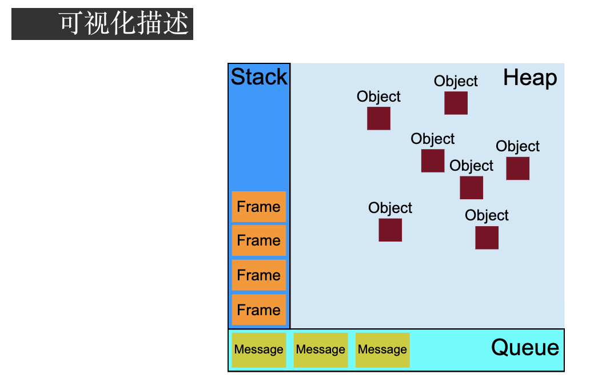

## js基础：

### ECMAScript：

## 1. const、let、var关键字区别？

- let和var的作用差不多。

区别：

1.let声明的变量是块作用域，var声明的变量是函数作用域。var会有声明变量提升（在声明前就可饮使用，值为undefined），let声明的变量不会在作用域中提升。

2.全局声明：使用let在全局作用域声明的变量不会成为window属性（var声明的则会成为window对象的属性）

- const行为和let基本相同。唯一重要的区别是const声明变量时，必须同时初始化变量。且尝试修改const声明的变量会导致错误。

__声明的最佳实践风格就是: 不使用var。const优先，let次之__

## 2. 简述 Javascript 的数据类型?

<details>&emsp;:pencil2:A:Number、String、Bloonean、Null、Undefined和Symbol 六种基本数据类型，<span style='background-color:lightgreen'>一种引用数据类型Object（Function，Array）</span>。 

基本数据类型的值是不可变的。基本数据类型不可以添加属性和方法。基本数据类型是存放在栈中（栈区包括了变量的标识符和变量的值）

引用类型可以改变。引用类型的可以添加属性和方法。引用类型赋值是对象引用（一个指针，两个指针同时指向同一个堆内存对象）

基本包装类（包装对象）：String、Number、Boolean。**ECMAScript还提供了三个特殊的引用类型Boolean,String,Number.我们称这三个特殊的引用类型为基本包装类型，也叫包装对象**.

https://segmentfault.com/a/1190000008472264

### 遍历对象的方法？

1.for...in  会遍历对象（<font color='red'>自身的 和  继承的</font>）可枚举属性，不会遍历Symbol【尽量不要用for..in,而使用Object.keys()】

2.Object.keys(obj )   **返回一个数组**，包含对象 自身的 可枚举属性，不遍历Symbol。

3.Object.getOwnPropertyNames(obj )   **返回一个数组**，包含对象自身的所有属性**（包括不可枚举属性）**

4.Objext.getOwnPropertySymbols(obj)  **返回一个数组**，包含对象中所有键名是Symbol的属性。

5.Reflect.ownKeys(obj)  **返回一个数组**，包含对象自身中所有键名。不管键名是否可枚举，也不管是否是Symbol

## 3.​  Javascript 中 == 与 === 的区别是什么？

相等（==）操作符会进行强制的类型转换。全等操作符不会，只有两个值完全相等才会返回true。相等运算符（null == undefined）为true，全等为false。【实际上undefined是null派生出来的一个对象，他俩很相似，所以相等运算符为true。对于全等运算符而言他俩是不同的数据类型】

由于相等操作符会进行类型转换，所以推荐使用全等操作符。这样有助于保持代码中数据类型的完整性。

##  6. 简述 Javascript 原型以及原型链

一个函数在创建的时候都会在其内部初始化一个属性，属性名是prototype（原型）。

当我们访问对象属性的时候，首先会在这个对象的内部进行查找，如果找不到就会到它的原型对象上查找，它的原型还会有自己的原型，就这样一级一级查找下去就形成了原型链。

## 7. 简述 Javascript 中 this 的指向有哪些？

* 以**函数调用**的时候，this指向window。

* 以**方法调用**的时候，this指向调用它的对象。

* 以关键词new创建的构造函数，如果返回值是对象就指向返回值，否值指向创建的对象。

* 使用call/apply调用时，this是指定的那个对象。


##  8. 箭头函数和普通函数的区别是什么？

0.箭头函数语法更简洁、清晰；

1.箭头函数没有this，它的this指向其上下文的this；

2.箭头函数不能使用arguments、super和new.target，也不能用作构造函数。

3.箭头函数没有prototype属性。

## 9. 什么是闭包，什么是立即执行函数，它的作用是什么？简单说一下闭包的使用场景？

函数A返回一个函数B，函数B中使用了函数A变量，函数B就是闭包。

立即执行函数:__声明一个匿名函数并马上调用它。__作用就是创建一个独立的作用域。可以解决闭包内存泄漏的问题。

闭包使用场景：1.可以用闭包实现公共方法，访问位于包含作用域中的变量。

2.可以访问私有变量的公共方法（特权方法）。


## 10. JavaScript 中的严格模式是什么，有什么作用？

严格模式：是采用具有限制性JavaScript变体的一种方式，从而使代码脱离了“稀松懒散”的模式。

1.严格模式通过__抛出错误__消除一些原有的__静默错误__。

2.严格模式修复了一些导致JavaScript引擎难以执行优化的缺陷：有时候相同的代码，严格模式比非严格模式运行的更快。

3.严格模式__禁用了__在ECMAScript未来版本中可能会定义的一些语法。


## 11.作用域链？

内部函数访问外部函数的变量，采用的是链式查找的方式来决定取哪个值。这种结构称之为作用域链。

全局函数无法访问局部函数的内部细节，但是局部函数可以访问其上层函数的细节，直至全局细节。


## Javascript 可以保存的最大数值是多少

js可以表示的最大数值保存在Number.MAX_VALUE中，可以表示的最小数值保存在Number.MIN_VALUE中

 Number.MAX_VALUE :1.797e+308

Number.MIN_VALUE:5e-324;  

## promise有哪些状态？简述Promise.all的实现原理。

promise是用来异步编程的，可以看成是一种状态机。初始状态是pending。可以通过resolve函数或者reject函数，将状态改变为resolved或者rejected。状态一经改变就永远不会变。

promise有then函数，该函数返回一个新的promise实例。

Promise.all方法接收一个含有promise实例的数组作为参数，返回一个promise对像。

如果数组中的所有promise返回的都是resolved状态，Promise.all的状态才会是resolved。如果数组中有rejected状态，那么Promise.all就返回第一个reject函数的返回值。

## 简述常见异步编程方案 (promise, generator, async) 的原理

&emsp;:pencil2:A:他们三个都是用来异步编程的。

[主要参考](https://www.wolai.com/mary/9g1TdT8ZmrSgY5aEYp5g6n)

**generator**是生成器。给函数加上*号，就代表是gennerator函数，这个函数就有next()方法。通过yield控制函数执行的步骤，调用next()方法函数可以继续执行被暂停的代码。

**promise**见上题。

**async**的返回值是一个promise，在函数内部使用await来控制异步执行。

### 用Promise并行加载100张图片，但是只能使用10个Promise

[可参考](https://blog.csdn.net/cs840610862/article/details/91867964)

```js
    //图片并行加载
    function loadImg(src) {
      return new Promise((resolve, reject) => {
        let img = new Image();
        img.src = src;
        img.onload = function () {
          resolve(img)
        };
        img.onerror = function (err) {
          reject(err)
        };
      })
    }

    function showImg(imgs) {
      imgs.forEach((img) => {
        document.body.appendChild(img);
      })
    }

    Promise.all([
      loadImg('1.jpg'),
      loadImg('2.jpg'),
      loadImg('3.jpg'), 
      loadImg('4.jpg'), 
      loadImg('5.jpg')
    ]).then(showImg)
```


## proxy

proxy是ES6新增的功能，可以用来自定义对象中的操作

`let p = new Proxy(target,handler)`

使用proxy可以很方便实**现数据的绑定和监听**

## 简述 Javascript 中的防抖与节流的原理并尝试实现

函数防抖是指多次顺序的调用（点击、提交）合并为一次（点击）。

节流就是每隔多久才会执行一次函数（如resize、scroll等频繁发生的事。比较适合应用于有关动画的场景）

节流场景：**无限滚动**

用户向下滚动无限滚动页面，需要检查滚动位置距底部多远，如果邻近底部了，我们可以发 AJAX 请求获取更多的数据插入到页面中。

* **debounce**：把触发非常频繁的事件（比如按键）合并成一次执行。
* **throttle**：保证每 X 毫秒恒定的执行次数，比如每200ms检查下滚动位置，并触发 CSS 动画。
* **requestAnimationFrame**：可替代 throttle ，函数需要重新计算和渲染屏幕上的元素时，想保证动画或变化的平滑性，可以用它。注意：IE9 不支持。

## 简述 Javascript 的柯里化与逆柯里化★★★

**柯里化：**把一个接受多个参数的函数    变成一个接受单个参数的函数。

主要作用：**提高函数的专用性**

**柯里化的好处：**

1、参数复用：对于一些有很多参数相同的函数调用情况，柯里化就非常适用了。

2、提前返回：提前返回函数避免重复操作，提高效率。

3、延迟执行：在所有参数接收完毕后延迟统一执行

**逆柯里化：**柯里化的逆过程，目的是扩大函数的适用范围。

#### 经典用例：

> 数组的push方法只能用于数组，我们现在通过反柯里化提取push函数，让它也适用于Object对象。

## DOM部分

### 事件循环机制 Event loop?

js是非阻塞单线程语言，在加载的过程中如果碰到同步代码就放到执行栈中。碰到异步代码就放到 Callback Queene（任务队列中）中。当执行栈中的同步代码执行完了，就会去异步队列中拿出相应的代码放到执行栈中执行。执行完当前任务以后，会再去任务对列获取相应代码执行，直到任务队列为空。这个过程就是Event loop。



微任务：Promise、process.nexTick(node.js独有)、MutationObserver

宏任务：script、setTimeout、setInterval、setImmediate、I/O(磁盘读写或网络通信)、UI rendering(UI交互事件)

执行顺序：**同步事件 --> 微任务 --> 宏任务--> 宏任务同步事件 --> 宏任务中的微任务 -->宏任务**

### 事件的级别

**0、DOM0:**

`ele.onclick = function(){}`

**2、DOM2:**

```javascript
ele.addEventListener('click',fn,false)
```

第三个参数代表事件在什么阶段触发。

<font color=bule>true，代表捕获阶段触发。</font><font color=blue>false，代表冒泡阶段触发(默认)。</font>如果不写默认false。

**3、DOM3:**

`ele.addEventListener('keyup',fn,false)`

DOM3事件就是新增加了键盘、鼠标事件

### 简述 Javascript 事件冒泡和事件捕获原理

事件流一共有三个阶段：事件捕获、目标阶段、事件冒泡

事件捕获：就是自上而下，从window对象一级一级捕获到目标对象

目标阶段：事件通过捕获到达目标元素的这个过程叫做目标阶段。

事件冒泡：自底向上，一级一级冒泡到最顶端window对象。

### 阻止冒泡、取消默认事件

阻止冒泡：stopPropagation()。阻止冒泡阶段事件的传播。

立即阻止冒泡：stopImmediatePropagation()。如果同一元素上绑定多个事件处理程序。如果触发了这个元素上的一个事件监听，其他事件也会按照添加顺序执行。如若在一个监听事件中使用了这个方法，那么就会只执行当前触发的事件。

取消默认事件：preventDefault（）/returnValue()。比如有个<a>标签绑定了click事件，点击就会跳转，如果设置了阻止默认事件就不会跳转了。

### 事件委托/代理

如果一些节点是动态生成的，那么要给这些子节点注册事件就应该注册在父节点上。

**动态绑定事件：节省内存空间、不需要给自节点注销事件**

**事件代理优点：**

1、利用冒泡机制，减少事件绑定次数，节省大量的内存消耗，提高性能。

**局限性：**1、focus、blur事件没有冒泡机制，不能用事件代理

2、mousemove、mouseout 这样的事件，虽然有事件冒泡，但是只能不断通过位置去计算定位，对性能消耗高，因此也是不适合于事件委托的

event || window.event【兼容性写法】

target  || srcElement【兼容性写法】

