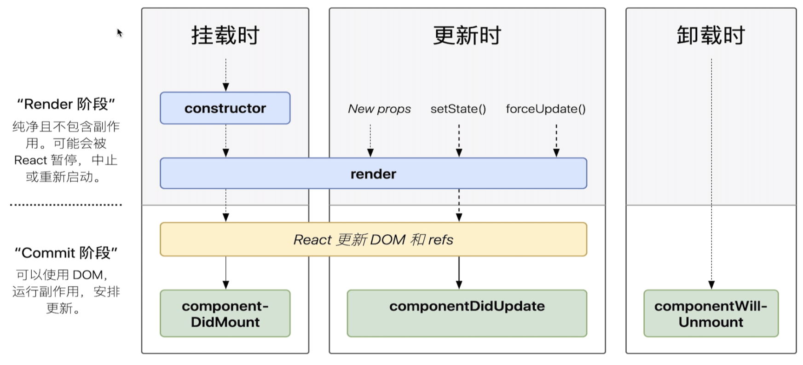
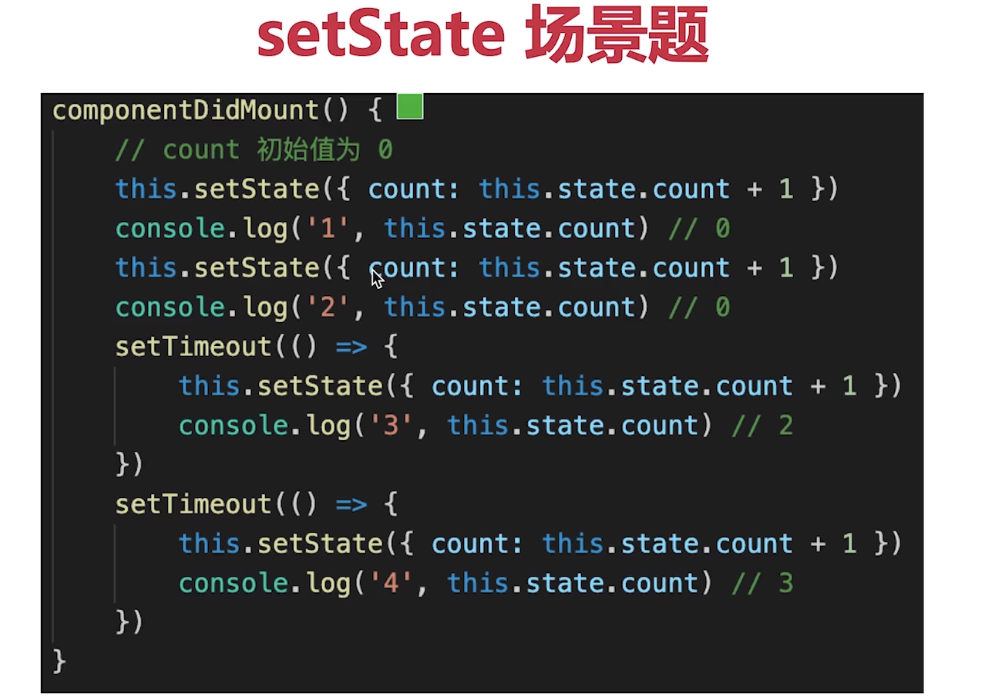
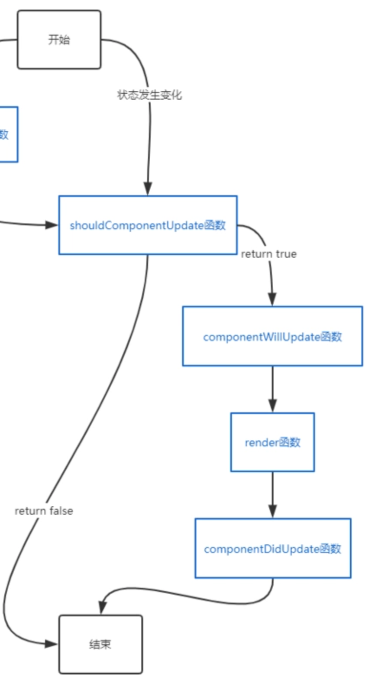
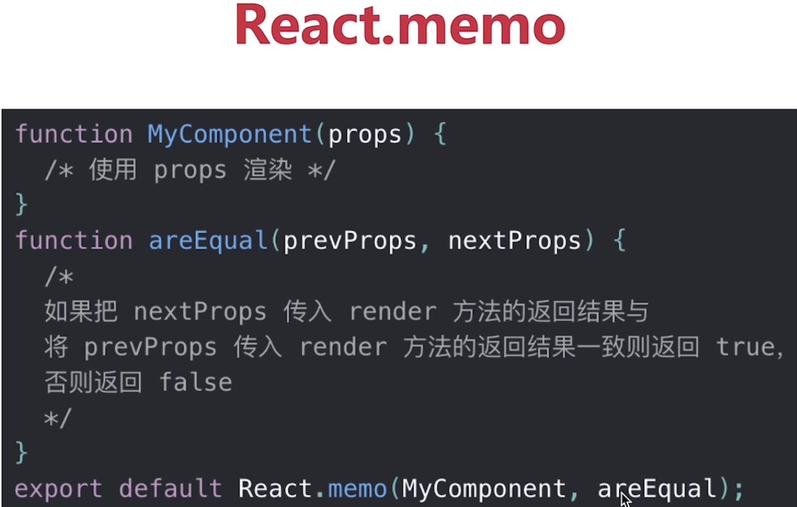
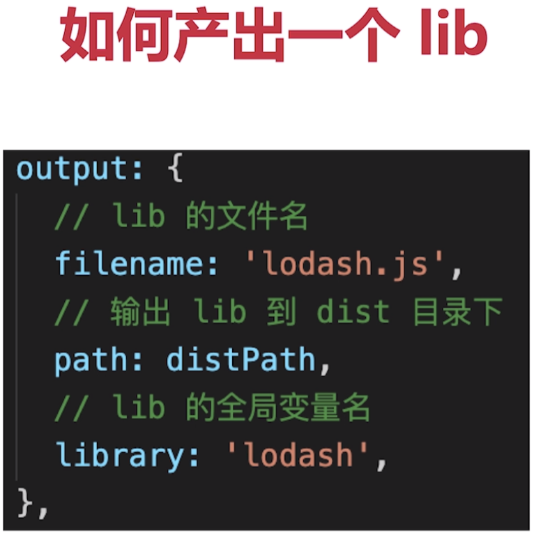

**create-react-app 创建项目**

## 什么是纯函数

一个函数的返回结果只依赖于它的参数，并且在执行过程中没有任何副作用。这样的函数称之为纯函数。

* **返回结果只依赖  参数**
* **执行过程没有副作用**

纯函数非常靠谱，执行一个纯函数不会担心它会干什么坏事，它不会产生什么不可预料的行为，也不会对外部产生影响。不管何时何地，你给它什么它就会乖乖吐出什么。

如果应用程序大多使用的都是纯函数，那么程序调试、测试起来会非常的方便。

如 arr1 = arr.slice()

## JSX本质是什么？（对比vue模板编译）

<span style="background-color: pink">**通过React.createElement("tag", {props}, children)函数     --->    返回一个vnode    ---->     vnode再根据patch函数，决定节点的渲染情况**</span>

就是用createElement这个方法编写DOM。createElement就相当于是h函数

render函数执行完返回Virtual  DOM  tree（虚拟DOM树）


## React事件和DOM事件的区别（Vue和React对比，非常重要）

Vue中的event事件是原生事件（MouseEvent）。就是DOM事件。

1、React中的event事件不是原生，是合成事件--->SyntheticEvent。但是模拟出了 DOM 事件所有能力。

2、SyntheticEvent里面的nativeEvent是原生事件对象（MouseEvent。）

3、React所有事件，都被挂载到 根元素上。

**为什么要有合成事件机制？合成事件的优点：**

更好的兼容性 和 跨平台

挂载到根元素上，减少内存消耗，避免频繁的解绑事件（类似事件委托，事件委托是利用事件的冒泡原理来实现的）

方便事件的统一管理（如事务机制）

4、和 Vue事件也不一样。


## React组件生命周期




单组件生命周期和父子组件生命周期关系，同vue

注意SCU

## React发起ajax应该在哪个生命周期

同Vue

ComponentDidMount


## setState场景题



### setState 后执行什么生命周期

属性（props）发生变化 或者 状态（state）发生变化

可能会引起重新渲染，执行完 setState 是 compomentWillUpdate-->compomentDidUpdate



## 渲染列表，为何使用key

 同Vue。必须用key，且不能是index 和 random

diff算法中通过tag和key来判断，这个节点是否是sameNode

减少渲染次数，提升渲染性能


## 组件之间如何通讯？

 父子组件props

自定义事件

Redux和Context


## 函数组件 和 class组件 区别

纯函数，输入props，输出JSX

没有实例，没有生命周期，没有state

不能扩展其他方法 


## 什么是受控组件，非受控组件？

React的state成为表单元素的“唯一数据源”，

表单的值，受state控制。需要自行监听onChange、onSubmit这些事件，更新state。

<span style="background-color:lightblue">推荐使用受控组件来处理表单数据，因为这时的表单数据是由React组件来管理的。</span>

<span style="background-color:lightblue">非受控组件的表单数据是交由DOM节点来处理。</span>

对比非受控组件（可能问的更多一点）


## 何时使用异步组件

同Vue

加载大组件

路由懒加载

 

## 多个组件有公共的逻辑，如何抽离？

高阶组件 HOC

Render  Props

mixin已经被react废弃（和Vue的mixin一样的）

## Context是什么，如何应用？

 父组件，向其下所有子孙组件传递信息

如一些简单的公共信息：主题色、语言等

复杂的公共信息，请用redux（比如数据管理，业务数据比较复杂）

## shouldComponentUpdate 用途

```javascript
shouldComponentUpdate ( nextProps,nextState) {
		if( nextProps.count === this.state.count){
				return true;	//可以渲染     
		}
		return false;	//不重复渲染
}
//如果不做定制   默认情况返回true
```

SCU默认返回true，即 React默认  重新渲染所有子组件。

SCU  必须要配合  “不可变值 ”  使用，否则容易出错

控制当前组件是否渲染，需要性能优化时才使用


## Component 和 PureComponent、memo有何区别

* `React.PureComponent` 与 `React.Component` 很相似。

  shouldComponentUpdate(prevProp,newProps),通过对比prevProps和newProps的进行对比，来判断需不需要重新渲染。

  <font color=deeppink>两者的区别在于 `React.Component`并未实现 `shouldComponentUpdate()`，而 `React.PureComponent` 中以浅层对比 prop 和 state 的方式来实现了`shouldComponentUpdate`函数</font>

* memo，函数组件中的PureComponent

  优化函数冲渲染功能

浅比较已经适用于大部分情况（尽量不要做深度比较）

<font color=red>但要结合不可变值使用</font>




## 简述 React 中的 Effect Hook 机制0

类组件的问题：

* 缺少复用机制，状态逻辑难以复用
* 状态和生命周期 
* this指向的困扰 


### React Hooks

useSate（）；可以使用函数定义默认值。useState使用次数不能多也不能少。

useEffect，执行的是副作用，需要在渲染完成后执行

useContext，

useMemo/Callback，有对比返回值，useMemo是在渲染期间完成的 

如果useMemo()里面是是一个函数，useCallback(fn)和它是一样的。


Hooks优势

* 方便复用状态逻辑
* 副作用的关注点分离
* 函数组件无this问题


#### 生命周期函数如何映射到Hooks？

useEffect（），可以实现


####  类实例成员变量如何映射到Hooks？


## 简述 React setstate 原理




## redux单项数据流（会写，考频高）


## redux如何进行异步请求

使用异步 action

如 redux-thunk 


## react-router如何配置懒加载

 


## React性能优化  (很重要)

渲染列表使用key

自定义的事件、DOM事件及时销毁

合理使用异步组件，较大的组件使用异步加载

 合理使用 SCU  PureComponent 和memo。减少运行时不必要的渲染。提升性能。

 合理使用<span style="background-color:rgb(255, 255, 128)"> Immutable对象（加速嵌套数据的比较，不是深拷贝，速度好）</span>

按需使用 & state层级尽量扁平化，不要嵌套过深。


## React和Vue的区别

都支持组件化

都是数据驱动视图

都使用vdom操作DOM

### 区别

React使用JSX拥抱  JS（就是在写js），Vue使用模板拥抱   html（在写html）。

React是函数式编程，Vue是面向对象编程。

事件不一样。React-SyntheticEvent，Vue-原生event

React需要自力更生，Vue把想要的都给你


# <font color=steelblue>webpack</font>

### 1、前端代码为何要进行构建和打包？

**代码层面：**

体积更小（Tree-Shaking、压缩、合并），加载更快

编辑高级语言或语法（TS，ES6+，模块化，scss）

兼容性和错误检查（Polyfill、postcss、eslint）

**研发流程：**关注研发流程，关注团队整体开发效率

统一高效的开发环境

统一的构建流程和产出标准

集成公司构建规范（提测、上线等）

#### 2、module、chunk、bundle 分别什么意思，有何区别？

module - 各个源码文件(html\js\css、图片等文件)，webpack中一切皆模块。

chunk - 多模块合成的代码，如entry入口文件 、  import( )、 splitChunk。

bundle - 最终的输出的文件（一般是打包的chunk的文件输出）

#### 3、loader 和 plugin 的区别？

loader 模块转换器，如 scss-->css。把相应的文件转换成另一种文件。

plugin 扩展插件，如 HtmlWebpackPlugin，把js、css文件塞进相应的html文件中去。

#### 4、webpack 如何实现懒加载？

import（“./path”）

结合Vue  React异步组件来说

结合 Vue-router  React-router 异步加载路由

#### <font color=DarkMagenta>webpack常见性能优化</font>

**优化打包构建速度 -- 开发体验和效率**

1.优化 babel-loader

```javascript
//优化 babel-loader
{
  test:/\.js$/,
  use:['babel-loader?cacheDirectory'];//1、开启缓存
  //cacheDirectory：没有改动的代码就不会重新编译，会使用缓存的代码。
  include:path.resolve(_dirname,'src');//2、明确范围
  //exclude：path.resolve(_dirname,'node_modules')  二选一就可以
}
```


2、IgnorePlugin

```javascript
//避免引入无用模块  比如引入一个日期模块moment ，这个模块支持很多
//种语言，所以会很大，这个时候可以使用IgnorePlugin，来限制只引入
//中文
new webpack.IgnorePlugin(/.\/locale/,/moment/);//忽略moment文件下的所有语言包

import 'moment/local/zh-cn' //然后在使用文件下  手动引入所需文件包
```


3、noParse ：避免重复打包

```javascript
//就是对一些已经打包过的模块（比如：react.min.js），忽略对它打包，因为这些模块已经是打包处理过的。
modlue:{
  noParse:[/react\.min\.js$/],
}
```

**IgnorePlugin  Vs  noParse**

IgnorePlugin 是直接不引入，按需引入，没用的部分代码中没有。

noParse 引入，但是不参babel的构建与打包，和模块化的分析。


4、happyPack  多进程打包

```javascript
//js单线程，开启多进程打包
//提高构建速度（特别是多核CPU）
module:{
	rules:[{
		test:/.\.js$/,
		use:['happypack/loader?id=babel'],//这里id要 对应plugin中的id
    exclude:/node_modules/
	}]
}，
plugin：[
  new happyPack({
    id:'babel',  //id要对应
    loaders:['babel-loader?cacheDirectory'] 
  })
]
```


5、ParalleUglifyPlugin  多进程压缩 JS（用于生产，开发环境没用）

```javascript
//webpack 本身自带Uglify 压缩JS 但是默认不是多进程的
//JS是单线程  开启多进程压缩  打包回更快一下。和happyPack同理
 
```

**4、5两种情况要按需使用：**

* 项目比较大，打包很慢，可以开启多进程打包 提高速度
* 项目很小，打包很快，开启多进程就会降低打包速度（因为开启多进程，进程要启动、进程也要销毁、多进程之间会通讯。这个的开销也是比较大的）

6、自动刷新，开发环境下设置devServer。就默认开启自动刷新了。（不用生产环境，只为提升开发体验）

7、热更新 HotModuleReplacementPlugin。但需要自己配置哪些模块需要开启热更新。（不能用于生产环境）

**6、7比较：**

* 自动刷新，整个网页全部刷新，速度较慢。整个网页全部刷新，状态丢失。
* 热更新，只更新修改过的代码。但是要自己配置。

8、DllPlugin：动态链接库插件，针对比较大的库（不用生产环境，只为提升开发体验）

先提前打包好，然后在使用

webpack已经内置Dllplugin支持

DllPlugin -- 打包出dll文件

DllReferencePlugin -- 使用dll文件


**优化产出的代码  --  产品性能**（主要和产品线上性能相关）

打包后的代码体积更小

合理分包，不重复加载

速度更快，内存使用更少

1、小图片使用 base64编码，不用请求图片了。

2、bundle  +  hash（代码不变的情况下能命中缓存）

3、懒加载（比较大的文件使用懒加载，先把重要的文件加载出来，然后再异步加载大文件）

4、拆分打包，提取公共代码

5、使用production。【自动开启代码压缩。Vue React等会自动删掉调试代码。自动启用Tree-Shaking（删除没有用的代码）】

6、使用 Scope Hosting。作用：多函数合并成一个函数。创建函数少了，函数作用域随之减少，执行的更快。代码体积更小。

```javascript
module.export={
	resolve:{
    //针对 Npm 中的第三方模块优先采用jsnext：main  中指向的ES6模块话语法的文件
    mainFields:['jsnext:main','browser','main']
  },
  plugins:[
    new ModuleConcatenationPlugin(),
  ]
}
```

### 如何产出一个lib



### babel和webpack区别？

babel -- js新语法是解析工具，不关心模块化

webpack处理模块化，打包构建工具，是多个loader plugin的集合。（webpack怎么配置一个loader，配置一个plugin它就有什么样的能力）


### babel-runtime 和 babel-polyfill 的区别

babel-polyfill （7.4已被弃用，直接使用core-js和regenerator）就是 core-js和regenerator 的集合。会污染全局。

core-js是处理 ES6、 ES7等语法的兼容性问题的工具。但是core-js中没有处理generator的方法，所以有regenerator工具来处理generate语法。

<span style="background-color:LightYellow">总结下, `Babel` 只是转换 `syntax` 层语法，所有需要 `@babel/polyfill` 来处理API兼容,又因为 `polyfill` 体积太大，所以通过 `preset`的 `useBuiltIns` 来实现按需加载,再接着为了满足 npm 组件开发的需要 出现了 `@babel/runtime` 来做隔离</span>


### 为什么 Proxy不能被Polyfill？

<span style="background-color:lightyellow">因为 Proxy的功能无法用原生的某个方法来模拟。</span>

比如Class可以用function模拟、Promise可以用callback模拟。但是Proxy的功能Object.defineProperty() 无法模拟。

### ES6 Module 和 CommonJs区别？

ES6Module是静态引入，**编译时**就引入

CommJS是动态引入，**执行时**才会引入

只有ES6 Module 才能静态分析，实现Tree-Shaking

