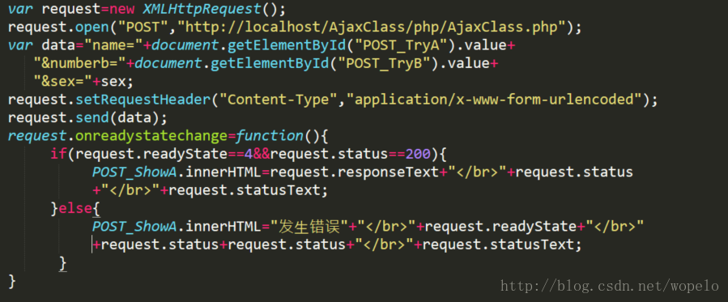
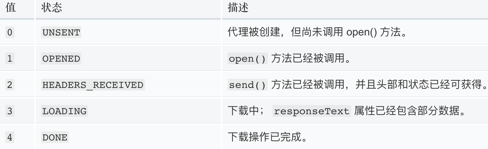

### :question:简述 jsonp 的工作原理

&emsp;:pencil2:A：**jsonp其实就是利用了<scritp>标签没有跨域限制的漏洞，来达到与第三方通讯的目的。**在有需要通讯的时候，就创建一个<scritp>元素，地址指向第三方API网址，形如：<script src="http://www.example.net/api?param1=1&param2=2"></script>；然后把请求回来的数据回调函数中处理。  

```javascript
//代码实现
let newScript = document.createElement('script');
newScript.src = 'https://www.abd.com?callback=fn()';
document.body.appendchild(newScript);
function fn(data){
  console.log(data)
}
```


### 	:question:简述 CORS 的用途以及基本设置（高频）

&emsp;:pencil2:A：CORS主要用于跨域求。

**浏览器会自动进行CORS通信，实现CORS通信的关键在后端。**只要后端实现了CORS，就实现了跨域。

服务端设置 Access-Control-Allow-Origin，就开启了CORS。可以设置哪些域名可以访问资源，如果设置通配符，就是所有网站都可以访问资源。

**【document.domain---->另一种跨域方式】**

该方式只能用于二级域名相同的情况下，比如 a.test.com 和 b.test.com 适用于 该方式。

只需要给页面添加 document.domain = 'test.com' 表示二级域名都相同就可以实 现跨域

### :question:什么是跨域，什么情况下会发生跨域请求？

&emsp;:pencil2: A：跨域就是从一个域向另一个域请求的时候，由于受到浏览器同源策略的限制，就需要跨域。（同源策略：协议、域名、端口号相同）。前后端通信，如果不在一个域就需要跨域请求。

解决办法：

1.hash。

url的`#`后面的内容就叫Hash。**Hash的改变，页面不会刷新**。这就是用 Hash 做跨域通信的基本原理。

补充：url的`?`后面的内容叫Search。Search的改变，会导致页面刷新，因此不能做跨域通信。

2.jsonp跨域：

3.从代理入手：不在浏览器请求，从同项目的后台进行请求，再把请求结果返回给前台。（因为只有浏览器有同源策略）

4.从CORS入手：后台的请求响应头告诉浏览器**“我这个请求很安全，允许当前域名跨域访问”**。实现：利用CORS（Cross-Origin-Resource Sharing，跨资源共享），W3C的一个标准，浏览器检测到这个响应头的一些字段值后，就会跳过同源策略。例如：res.header("Access-Control-Allow-Origin", "*"); //允许全部域名跨域，可以指定特点域名，逗号分隔    

 5、postMessage()方法**H5方法**

> H5中新增的postMessage()方法，可以用来做跨域通信。既然是H5中新增的，那就一定要提到。
>

### :question:readyState 的不同返回值有什么区别?





XMLHttpRequest.open()方法初始化一个请求。

XMLHttpRequest.send()方法用于发送HTTP请求。

<span style="background-color:lightgreen">AJAX技术：在不重新加载整个页面的情况下，向服务器交换部分数据并更新部分页面内容。这使得程序能够更快的回应用户的操作。异步通信手段。</span>

AJAX的核心是XMLHttpRequest对象，在AJAX执行过程中，readyState的值从0开始变化，当AJAX运行到send方法调用时，发送HTTP请求，HTTP请求安装步骤执行，此时status的值开始发生变化，AJAX运行机制等待HTTP请求返回结果。最后，当HTTP请求返回结果后，无论HTTP请求成功还是失败、也不管是否请求到正确信息，AJAX的运行机制都会继续执行，直到完成运行或者出错为止。  
