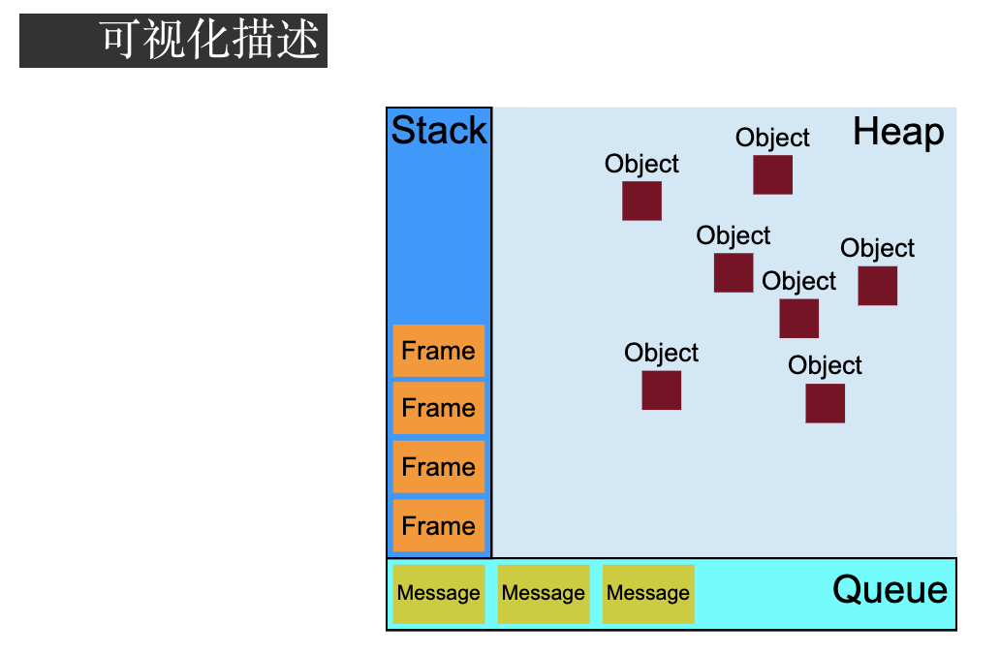

### :question:事件循环机制 Event loop?

:pencil2:A：js是非阻塞单线程语言，在加载的过程中如果碰到同步代码就放到执行栈中。碰到异步代码就放到 Callback Queene（任务队列中）中。当执行栈中的同步代码执行完了，就会去异步队列中拿出相应的代码放到执行栈中执行。执行完当前任务以后，会再去任务对列获取相应代码执行，直到任务队列为空。这个过程就是Event loop。



### :question:事件的级别

**0、DOM0:**

`ele.onclick = function(){}`

**2、DOM2:**

```javascript
ele.addEventListener('click',fn,false)
```

第三个参数代表事件在什么阶段触发。

<font color=bule>true，代表捕获阶段触发。</font><font color=blue>false，代表冒泡阶段触发(默认)。</font>如果不写默认false。

**3、DOM3:**

`ele.addEventListener('keyup',fn,false)`

DOM3事件就是新增加了键盘、鼠标事件

### :question:简述 Javascript 事件冒泡和事件捕获原理

事件流一共有三个阶段：事件捕获、目标阶段、事件冒泡

事件捕获：就是自上而下，从window对象一级一级捕获到目标对象

目标阶段：事件通过捕获到达目标元素的这个过程叫做目标阶段。

事件冒泡：自底向上，一级一级冒泡到最顶端window对象。


### :question:阻止冒泡、取消默认事件

阻止冒泡：stopPropagation()。阻止冒泡阶段事件的传播。

立即阻止冒泡：stopImmediatePropagation()。如果同一元素上绑定多个事件处理程序。如果触发了这个元素上的一个事件监听，其他事件也会按照添加顺序执行。如若在一个监听事件中使用了这个方法，那么就会只执行当前触发的事件。

取消默认事件：preventDefault（）/returnValue()。比如有个<a>标签绑定了click事件，点击就会跳转，如果设置了阻止默认事件就不会跳转了。

### :question:事件委托/代理

:pencil2:A：如果一些节点是动态生成的，那么要给这些子节点注册事件就应该注册在父节点上。

**动态绑定事件**

**事件代理优点：**

1、利用冒泡机制，减少事件绑定次数，节省大量的内存消耗，提高性能。

**局限性：**1、focus、blur事件没有冒泡机制，不能用事件代理

2、mousemove、mouseout 这样的事件，虽然有事件冒泡，但是只能不断通过位置去计算定位，对性能消耗高，因此也是不适合于事件委托的

event || window.event【兼容性写法】

target  || srcElement【兼容性写法】

