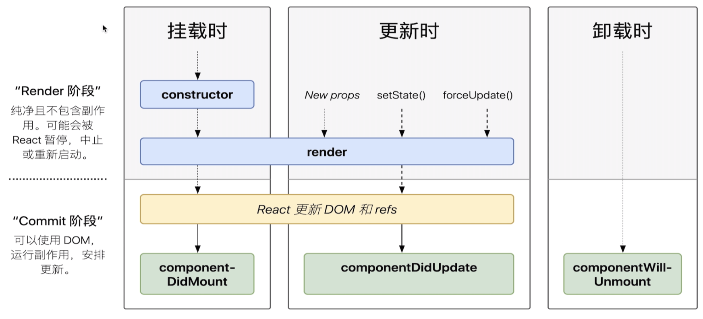
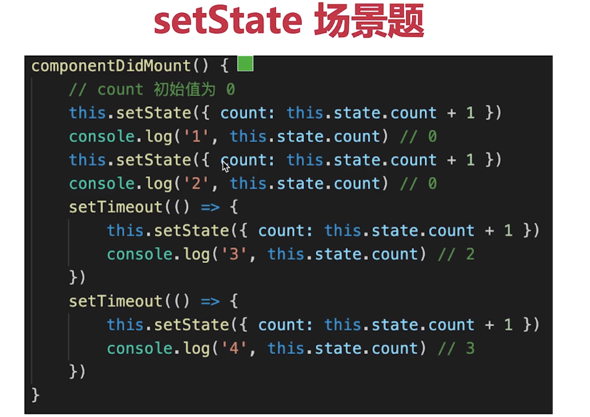
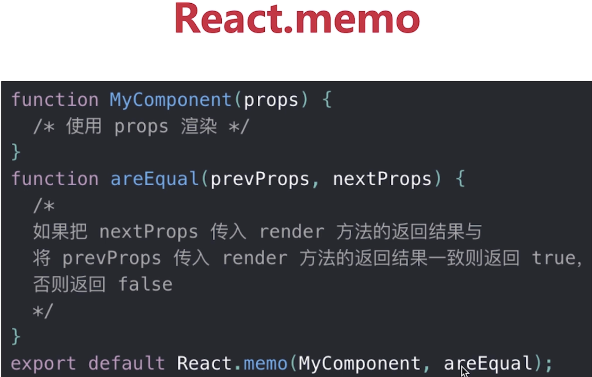

**create-react-app 创建项目**

## 什么是纯函数

一个函数的返回结果只依赖于它的参数，并且在执行过程中没有任何副作用。这样的函数称之为纯函数。

* **返回结果只依赖  参数**
* **执行过程没有副作用**

纯函数非常靠谱，执行一个纯函数不会担心它会干什么坏事，它不会产生什么不可预料的行为，也不会对外部产生影响。不管何时何地，你给它什么它就会乖乖吐出什么。

如果应用程序大多使用的都是纯函数，那么程序调试、测试起来会非常的方便。

如 arr1 = arr.slice()

## JSX本质是什么？（对比vue模板编译）

<span style="background-color: pink">**通过React.createElement("tag", {props}, children)函数     --->    返回一个vnode    ---->     vnode再根据patch函数，决定节点的渲染情况**</span>

就是用createElement这个方法编写DOM。createElement就相当于是h函数

render函数执行完返回Virtual  DOM  tree（虚拟DOM树）


## React事件和DOM事件的区别（Vue和React对比，非常重要）

Vue中的event事件是原生事件（MouseEvent）。就是DOM事件。

1、React中的event事件不是原生，是合成事件--->SyntheticEvent。但是模拟出了 DOM 事件所有能力。

2、SyntheticEvent里面的nativeEvent是原生事件对象（MouseEvent。）

3、React所有事件，都被挂载到 根元素上。

4、和 Vue事件也不一样。

**为什么要有合成事件机制？合成事件的优点：**

更好的兼容性 和 跨平台

挂载到根元素上，减少内存消耗，避免频繁的解绑事件（类似事件委托）

方便事件的统一管理（如事物机制）

## React组件生命周期




单组件生命周期和父子组件生命周期关系，同vue

注意SCU

## React发起ajax应该在哪个生命周期

同Vue

ComponentDidMount


## setState场景题




## 渲染列表，为何使用key

 同Vue。必须用key，切不能是index 和 random

diff算法中通过tag和key来判断，这个节点是否是sameNode

减少渲染次数，提升渲染性能


## 组件之间如何通讯？

 父子组件props

自定义事件

Redux和Context


## 函数组件 和 class组件 区别

纯函数，输入props，输出JSX

没有实例，没有生命周期，没有state

不能扩展其他方法 


## 什么是受控组件，非受控组件？

表单的值，受state控制

需要自行监听onChange，更新state

对比非受控组件（可能问的更多一点）


## 何时使用异步组件

同Vue

加载大组件

路由懒加载

 

## 多个组件有公共的逻辑，如何抽离？

高阶组件 HOC

Render  Props

mixin已经被react废弃（和Vue的mixin一样的）

## Context是什么，如何应用？

 父组件，向其下所有子孙组件传递信息

如一些简单的公共信息：主题色、语言等

复杂的公共信息，请用redux（比如数据管理，业务数据比较复杂）

## shouldComponentUpdate 用途

```javascript
shouldComponentUpdate ( nextProps,nextState) {
		if( nextProps.count === this.state.count){
				return true;	//可以渲染     
		}
		return false;	//不重复渲染
}
//如果不做定制   默认情况返回true
```

SCU默认返回true，即 React默认  重新渲染所有子组件。

SCU  必须要配合  “不可变值 ”  使用，否则容易出错

控制当前组件是否渲染，需要性能优化时才使用


## Component 和 PureComponent、memo有何区别？

* `React.PureComponent` 与 `React.Component` 很相似。

  <font color=deeppink>两者的区别在于 `React.Component`并未实现 `shouldComponentUpdate()`，而 `React.PureComponent` 中以浅层对比 prop 和 state 的方式来实现了`shouldComponentUpdate`函数</font>

* memo，函数组件中的PureComponent

浅比较已经适用于大部分情况（尽量不要做深度比较）

<font color=red>但要结合不可变值使用</font>




## 简述 React 中的 Effect Hook 机制0


## 简述 React setstate 原理




## redux单项数据流（会写，考频高）


## redux如何进行异步请求

使用异步 action

如 redux-thunk 


## react-router如何配置懒加载

 


## React性能优化  (很重要)

渲染列表使用key

自定义的事件、DOM事件及时销毁

合理使用异步组件（异步加载大组件）

减少函数 bind  this 的次数 

 合理使用 SCU  PureComponent 和memo

 合理使用<span style="background-color:rgb(255, 255, 128)"> Immutable对象（加速嵌套数据的比较，不是深拷贝，速度好）</span>

按需使用 & state层级尽量扁平化，不要嵌套过深。


webpack层面的优化

前端通用性能优化

使用SSR


## React和Vue的区别

都支持组件化

都是数据驱动视图

都使用vdom操作DOM

### 区别

React使用JSX拥抱  JS（就是在写js），Vue使用模板拥抱   html（在写html）。

React是函数式编程，Vue是面向对象编程。

React需要自力更生，Vue把想要的都给你


# <font color=steelblue>webpack</font>

1、前端代码为何要进行构建和打包？

#### 2、module、chunk、bundle 分别什么意思，有何区别？

module - 各个源码文件，webpack中一切皆模块。

chunk - 多模块合成的代码，如entry 、  import( )、 splitChunk

bundle - 最终的输出的文件（一般是打包chunk的文件）

3、loader 和 plugin 的区别？

#### 4、webpack 如何实现懒加载？

import（“./path”）

#### 5、webpack常见性能优化

**优化打包构建速度 -- 开发体验和效率**

1.优化 babel-loader

```javascript
//优化 babel-loader
{
  test:/\.js$/,
  use:['babel-loader?cacheDirectory'];//1、开启缓存
  include:path.resolve(_dirname,'src');//2、明确范围
  //exclude：path.resolve(_dirname,'node_modules')  二选一就可以
}
```

cacheDirectory：没有改动的代码就不会重新编译，会使用缓存的代码。


2、IgnorePlugin

```javascript
//避免引入无用模块  比如引入一个日期模块moment ，这个模块支持很多
//种语言，所以会很大，这个时候可以使用IgnorePlugin，来限制只引入
//中文
new webpack.IgnorePlugin(/.\/locale/,/moment/);//忽略moment文件下的所有语言包

import 'moment/local/zh-cn' //然后在使用文件下  手动引入所需文件包
```


3、noParse ：避免重复打包

```javascript
//就是对一些已经打包过的模块（比如：react.min.js），忽略对它打包，因为这些模块已经是打包处理过的。
modlue:{
  noParse:[/react\.min\.js$/],
}
```

**IgnorePlugin  Vs  noParse**

IgnorePlugin 是直接不引入，按需引入，没用的部分代码中没有。

noParse 引入，但是不参babel的构建与打包，和模块化的分析。


4、happyPack  多进程打包

```javascript
//js单线程，开启多进程打包
//提高构建速度（特别是多核CPU）
module:{
	rules:[{
		test:/.\.js$/,
		use:['happypack/loader?id=babel'],//这里id要 对应plugin中的id
    exclude:/node_modules/
	}]
}，
plugin：[
  new happyPack({
    id:'babel',  //id要对应
    loaders:['babel-loader?cacheDirectory'] 
  })
]
```


5、ParalleUglifyPlugin  多进程压缩 JS（用于生产，开发环境没用）

```javascript
//webpack 本身自带Uglify 压缩JS 但是默认不是多进程的
//JS是单线程  开启多进程压缩  打包回更快一下。和happyPack同理
 
```

**4、5两种情况要按需使用：**

* 项目比较大，打包很慢，可以开启多进程打包 提高速度
* 项目很小，打包很快，开启多进程就会降低打包速度（因为开启多进程，进程要启动、进程也要销毁、多进程之间会通讯。这个的开销也是比较大的）

6、自动刷新，开发环境下设置devServer。就默认开启自动刷新了。（不用生产环境，只为提升开发体验）

7、热更新 HotModuleReplacementPlugin。但需要自己配置哪些模块需要开启热更新。（不能用于生产环境）

6、7比较：

* 自动刷新，整个网页全部刷新，速度较慢。整个网页全部刷新，状态丢失。

* 热更新，只更新修改过的代码。但是要自己配置。

  

8、DllPlugin：动态链接库插件，针对比较大的库（不用生产环境，只为提升开发体验）

先提前打包好，然后在使用

webpack已经内置Dllplugin支持

DllPlugin -- 打包出dll文件

DllReferencePlugin -- 使用dll文件


**优化产出的代码  --  产品性能**


6、babel-runtime 和 babel-polyfill 的区别


css抽离：

使用 MiniCssExtractPlugin.loader 这个插件抽离css文件。生成单独打包文件，而不是用style-loader将文件放入html文件內。

使用optimization：{minimizer:[ ] }压缩css，使体积变的更小。


抽离公共代码 和 第三方代码：


懒加载：import（“./path”）


处理JSX   在.babelrc中配置       @babel/preset-react

处理vue  直接下载vue-loader，普通配置即可