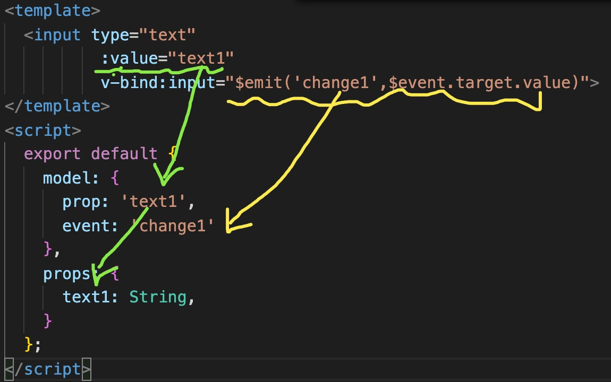
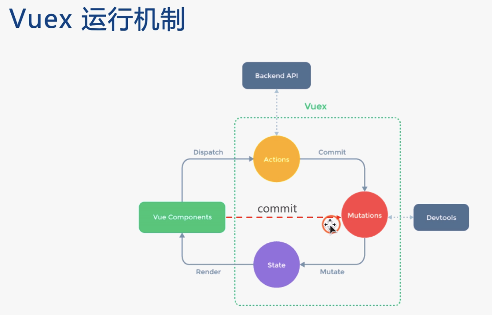
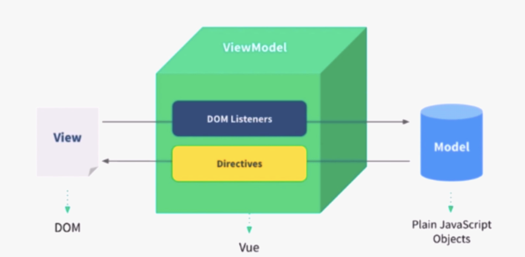
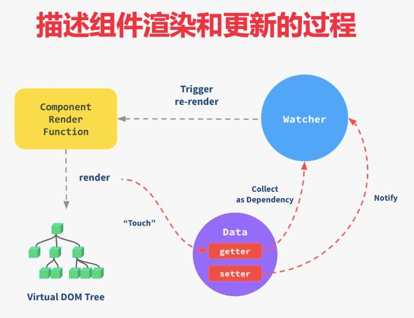

## <font color=red>data/state 数据结构设计 </font>

* 用数据描述所有内容

* 数据要结构化，易于程序操作（遍历、查找）

* 数据要可扩展，以便增加新的功能

  

## <font color=red>组件设计</font>

* 从功能上拆分层次
* 组件原子化（组件吸收🧽复杂度）
* 区分容器组件（只管理数据--->一般情况是最外层组件） &  UI组件（只显示视图）


## 简述虚拟 dom 实现原理

## 简述图片的懒加载原理

## 1、v-show 和 v-if区别？

* v-show通过CSS dispaly 控制显示和隐藏
* v-if是组件 完整的重建和销毁
* 频繁切换显示状态用v-show，否则用v-if

## 2、为何在v-for中使用key？

* 必须使用独一无二的key，不能是index和random
* **diff算法中通过tag和key来判断，当前这个节点是否是sameNode**
* **减少渲染次数，提升渲染性能**


## 3、双向数据绑定 v-model 的实现原理

* input元素的  value = this.name
* 绑定input事件   this.name= $event.target.value
* data 更新触发  re-render


## 4、如何自己实现v-model？



## 5、computed 有什么特点？

* 有缓存，开销小，data不变 就不会重新计算（最大的特点）
* 提高性能

## 6、为何组件的data必须是一个函数？

**因为每当组件复用，就是于对这个组件Class实例化。**如果data不是函数，那么被复用组件的数据就都共享了。data是函数  每个组件实例都有自己的私有数据空间。 就达到了作用域隔离的效果，他们只负责维护自己的数据，不会造成混乱。

## 7、什么是作用域插槽？

<font color=suntan>插槽：父组件要向   子组件中    传递的元素-->slot</font>( slot放在子组件中占个位置，也就是个插槽)

作用域插槽：父组件插入插槽的位置，需要用到子组件的属性。这个插槽就是作用域插槽。

## 8、ajax请求应该放在哪个生命周期

* mounted（整个页面渲染完成，DOM加载完成）
* JS是单线程，ajax是异步请求数据
* 放在mounted之前没有用，只会让逻辑更加混乱

## 9、如何将组件所有props传递给子组件？

Ps：将一个组件的所有属性，不分大小、不分多少  全部传递给子组件

* 方法用（$props）
* 使用方法<font color=deeppink>< User v-bind="$props" /></font>（是细节知识点，优先级不高）

## 10、动态组件

<font color=red>**使用场景：组件类型不确定。需要根据数据，动态渲染的场景。**比如做一个 新闻详情页，每个模块的类型是不确定的，text、image、video（视频）等。</font>

用法：☟                                

```javascript
//模板
<component :is="data里定义的属性--activeComponent">
//引入组件
import Zujan from './zujian'
export default{
  components:{
    Zujan
  },
  data(){
		return{
 	   activeComponent:Zujan   //和上面引入的组件名要对应
 		}
	}
}

```


## 11、Vue组件如何通讯（常见）？

* **父子**组件props  和  this.$emit(在子组件中使用)

  

* **自定义事件 （不限组件间的关系，都可以通过自定义事件实现通讯）**

```javascript
//注册事件
vm.$on('test', function (msg) {  console.log(msg) }) 
//触发事件
vm.$emit('test', 'hi') // => "hi"
```

<font color='deeppink'>event</font>.$on ('事件名'，'函数名')   绑定自定义事件

<font color='deeppink'>event</font>.$emit('事件名',<font color=red>'**参数**'</font>)       触发自定义事件

<font color='deeppink'>event</font>.$off('事件名','函数名') 	 销毁自定义事件（必须销毁，否则可能引起内存泄漏）

<font color='deeppink'>event</font>从哪来的呢？---->**event就是vue的实例☟，vue已经实现了自定义事件的能力**

```javascript
import Vue from 'vue'
export default new Vue();//直接new一个vue的实例
```


* vuex（所有组件都可以通讯）

## 12、多个组件有相同的逻辑，如何抽离？

**抽离多组件公共的业务逻辑，可以使用mixin**

```javascript
//用法：
import mixin from "./path"
data(){
  return{
    component:{
      mixins:[mixin]
    }
  }
}
```

就是把相同的部分单独拿出来放在一个文件，然后在需要使用这部分内容的文件中引入这个文件使用就可以。

**mixin的一些缺点：**

* 变量来源不明确，不利于阅读
* 多mixin可能会造成命名冲突
* mixin和组件可能出现多对多的关系，复杂度较高。

<span style="background-color:skyblue">Vue3中 提出了Composition API来解决mixin的缺点。</span>

## 13、何时要使用异步组件？（很重要，常考）

* **加载大组件**（比如加载一个编辑器、图标）
* **路由异步加载**（路由切换的时候）
* 优化性能

```javascript
// 异步加载  按需加载用法：
components:{
	//注册一个异步组件   实现按需加载
  AsyncComponent:()=> import('./path/一个路径') 
}
```

## 14、何时需要使用keep-alive？

* 缓存组件，不需要重复渲染

* 例如 ：多个静态tab页的切换

*  优化性能

  

 ## 15、Vue 为何是异步渲染，$nextTick有何用？（非常非常重要）

### vue组件是一步渲染的。目的：减少DOM操作次数，提高性能。

### <font color=purple>**异步渲染，将合并多次data修改，一次性更新视图**</font>

<font color=red>**$nextTick  待  DOM渲染完   再回调。用来获取   最新的DOM节点**</font>

用法：this.$nextTick(    ()=>{"我是回调函数"}   )


## 16、Vuex中 action 和 mutation 有何区别？

* action中处理异步（所有异步都在action中处理），mutation不可以（同步）

* mutation做原子操作（每次只做一个操作）

* action 可以整合多个 mutation

  

##  17、vnode 描述一个 DOM 结构

```html
<!--DOM结构-->
<div id='div1' class='container'>
  <p> vdom </p>
  <ul style="font-size:20px">
  	<li> a </li>
  </ul>
</div>
```

```javascript
//用vnode结构实现
{
  tag:'div',
  props:{
    id:'div1',
    className:'container'
  },
  children:[
    {
      tag:'p',
    	children:'vdom'
    },{
      tag:'ul',
      props:{style:'font-size:20px'},
      children:[
        {
          tag:'li',
          children:'a'
        }
      ]
    }
  ]
}
```


## 18、监听 data 变化的核心API是什么？

**核心API：Object.defineProperty**

缺点：

1、深度监听需要一次性递归到底（耗性能）

2、无法监听到  新增的属性/删除的属性  （Vue使用  Vue.set 和 Vue.delete来实现）

3、无法监听新数组，需要特殊处理（创建一个新对象，重新定义数组的原型，在新对象上重写push pop等方法，实现监听）

```javascript
let arrPrototype = Array.prototype;
let arrObjectDefineProperty = Object.create(arrPrototype);
//在arrObjectDefineProperty对象上重写  需要用到的方法
```

Vue3.0 使用Proxy 代替，但是Proxy也不是完美的，有兼容性的问题。

* 深度监听，性能更好

* 可监听新增删除的属性

* 可监听数组变化

  

## 19、Vue如何监听数组变化？

* 首先Object.defineProperty 不能监听数组变化

* 重新定义原型，重写push pop等方法，实现监听

  ```javascript
  let arrPrototype = Array.prototype;
  let arrObjectDefineProperty = Object.create(arrPrototype);
  //在arrObjectDefineProperty对象上重写  需要用到的方法
  ```

* Proxy可以原生支持监听数组变化


## 20、谈谈对  MVVM  的理解

第一步先说一下组件化（“很久以前”就有组件化，并不是新发明的）。比如node.js中就有组件。

第二部说一下，数据驱动视图（MVVM-->vue，setState-->react）

第三部连画带说，把下面这个图讲解出来。



由于前端的发展需求，以前都是通过直接操作DOM来改变页面变化。成本高，逻辑复杂难以维护

后来方便开发，出现了像Vue、React这样的框架。他们实现的理念就是用数据驱动视图。每个组件都有model（data中的数据），通过model中的数据来控制view的显示。view中的元素会有各种DOM事件的监听（DOM listeners），view通过触发监听函数来修改数。model中数据修改后驱动view界面更新。


## 21、请描述响应式原理？（非常重要）

1、监听data变化

2、组件渲染和更新的流程☟

## 22、描述组件渲染和更新的过程？



vue template complier 将模板编译为render函数

render函数执行完，生成vnode

通过vnode布局计算各个节点位置，浏览器绘画将页面绘制出来（painting），

如果有节点变更，就会有vnode对比，然后在重新渲染绘制。

### 初次渲染过程

* 解析模版为render函数（或在开发环境已经完成了，vue-loader）

* render函数执行，生成vnode，patch（ele，vnode）

* 触发响应式，监听data。（用getter，setter）

### 更新过程

* data中有数据更改，setter就会触发watcher，然后就会触发（Trigger）re-render。
* re-render重新渲染虚拟dom tree.
* patch(vnode,newVnode)对比更新vnode。


## 23、diff算法的时间复杂度  

1、遍历一遍tree1。 2、遍历一遍tree2 。 3、排序做对比。总时间复杂度O(n³)，不可用。

优化时间复杂度到O(n)的实现：

* <font color=blue>只比较同一层级，不跨级比较</font>
* <font color=blue>tag不相同，则直接删掉重建，不再深度比较。</font>
* <font color=blue>tag和key都相同，则认为是相同节点，不再深度比较</font>

## 24、简述diff算法的过程  

首先要从vdom的使用开始

* patch(elem,  vnode)  和  patch(vnode,  newVnode)

* patchVnode  和 adVnodes  和  removeVnodes
* updateChildren（key的重要性）


## 25、何时需要使用beforeDes troy？

* 解绑自定义事件  event.$off
* 清除定时器
* 解绑自定义的DOM事件，如window.scroll等

**如果不解除自定义事件可能会造成内存泄漏。**


## 26、Vue-router 常用的路由模式

* hash （默认）
* H5  history（需要服务端支持）两者比较
* 路由配置    


## 27、前端路由原理：

#### <font color=deeppink>监听hash：`window.onhashchange()`</font>

### hash特点：

1、hash变化会触发页面的跳转，浏览器前进、后退。

<font color=brown>**2、hash变化不会刷新页面，SPA（单页面应用）必须的特点。**</font>

3、hash永远不会提交到server端。（在前端自生自灭）

**4、无法使用锚点定位（a标签跳转），如果url被用作hash了，锚点定位就会失效。**


#### <font color=deeppink>监听history：`history.pushState() 和 window.onpopstate()`</font>

### history：

1、URL变化，页面不会刷新（SPA特点）。

**2、使用history需要后端的支持。**


## 28、如何配置 Vue-router 异步加载？

```javascript
//首先，配置path。然后component写一个箭头函数  使用import引入路径
[{
  path:'/',
  component:()=>import('./../components/Navigator')
}]
```


## 29、Vue常见的性能优化方式  0

<font color=gree>**Vue 层面优化：**</font>

* 合理使用v-show  和 v-if
* 合理使用computed（有缓存，提高性能）
* v-for 时加 key，以及避免和 v-if 同时使用（因为v-for 优先级更高，每次v-for，v-if都要重新计算一遍。这是对性能的一种浪费）
* 自定义事件、DOM事件及时销毁（不销毁可能导致内存泄漏。可能页面就会越用越卡，越用越卡直到卡死为止）
* 合理使用异步组件（针对比较大的组件）
* 合理使用keep-alive（不需要重复渲染的地方，用keep-alive缓存下来，不要渲染）
* data层级不要太深，尽量扁平化 

<font color=blue>**webpack 层面优化：**</font>

* 使用 vue-loader 在开发环境做模板编译（预编译）
* 使用SSR