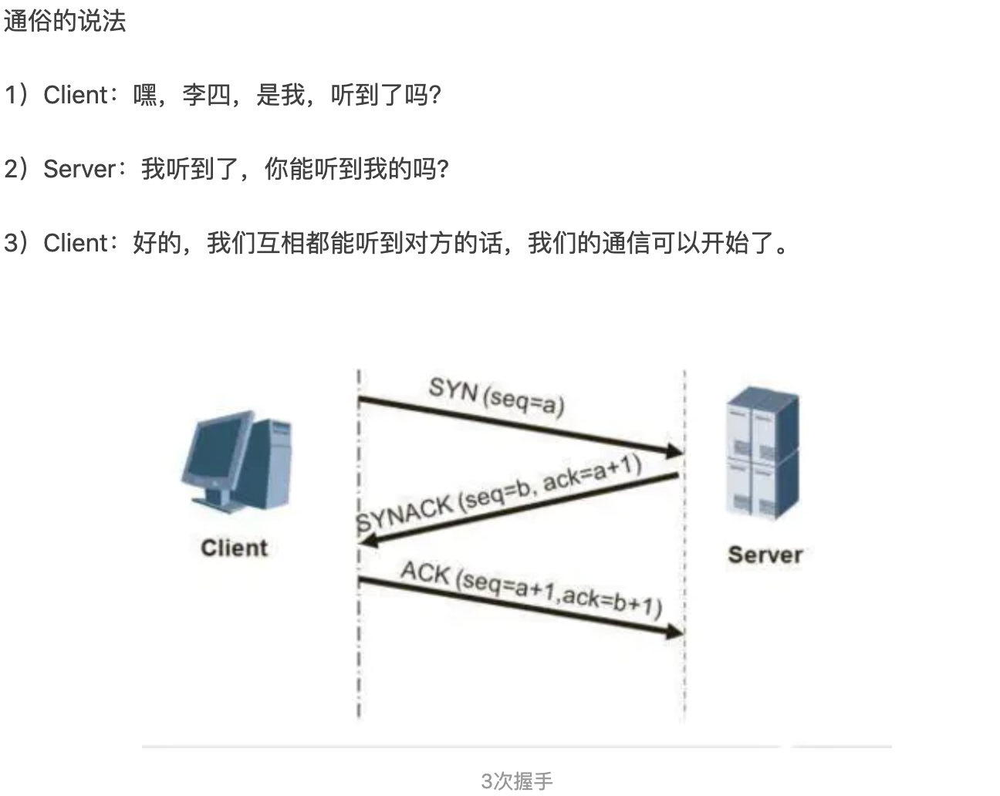
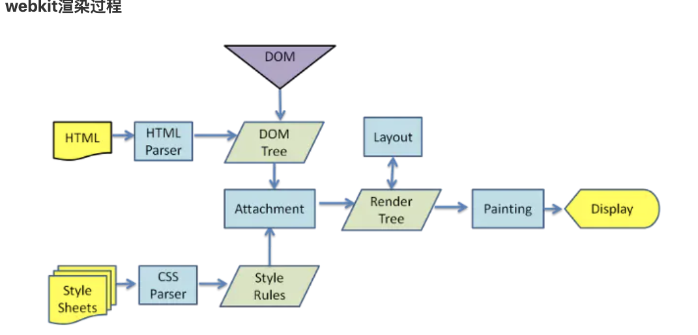
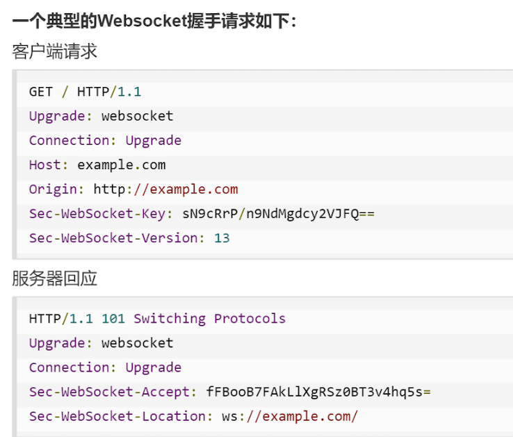
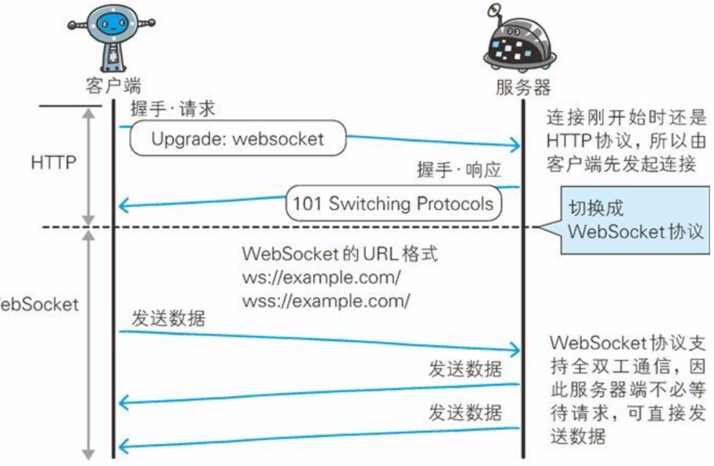

#### :question:简述常见的 HTTP 状态码的含义（301，304，401，403）

* 1xx：信息状态码，100:continue
* 200: 代表成功
* 300:资源重定向。
  * 301-永久重定向，表示资源已经永久的搬到了其他的位置。302-临时重定向。
  * 304-客户端发送附带的请求时，条件不满足（返回304时，不包含任何主体）【意思就是，你请求的资源倒是有，但是你说的条件不满足啊】
* 400:  客户端问题
  * 401-表示发送的请求要有HTTP认证信息或者认证失败了。
  * 403-Forbidden。表示请求的资源禁止访问（被服务器拒绝了）

500：服务器错误  

#### :question:简述HTTP 1.0、1.1、2.0的主要区别？

1、HTTP1.0：无连接，无状态，一次请求一个TCP连接

2、HTTP1.1：持久连接，请求管道化（有一些缺陷），增加了host字段，缓存，断点续传

3、HTTP2.0：二进制分帧（多路复用的实现基础），多路复用，头部压缩

#### :question:HTTP的keep-alive的原理和使用场景

HTTP是一个“请求-响应”协议，它的keep-alive主要是为了让多个HTTP请求共享一个TCP连接，以避免每个HTTP又新建一个TCP连接。HTTP1.1默认持久连接，只要有一方没有明确提出断开连接，则保持TCP连接的状态。这样可以减少TCP连接的重复建立和断开造成的额外开销，减轻了服务器端的负载；另外减少开销那部分时间，使HTTP请求和响应能够更早的结束，这样web页面显示的速度也相应的提高。

场景：比如，使用浏览器浏览一个包含多张图片的HTML页面时，在发送请求访问HTML页面资源的同时，也会请求HTML页面包含的其他资源。因此，每次的请求都会造成无谓的TCP连接建立和断开，增加通信量的开销。这时需要HTTP的keep-alive。

#### :question:TCP的keepalive

TCP设有保活计时器（keepalive timer）。服务端每收到一次客户端的数据，就重置保活计时器，时间通常设置2小时。若2小时没有收到客户端的数据，服务端就会发送一个探测报文段，以后每隔75分钟发送一次，若一连发送10个探测报文段后客户端仍没有反应，服务端就认为客户端出现了故障，接着就关闭这个连接。

#### :question:HTTP有哪些方法？

1.GET：发送一个请求来获取服务器上指定URL的资源。

2.POST：传输实体主体，向服务器提交数据或附加新的数据。

3.PUT：跟POST方法一样，可以向服务器提交数据。但是它们之间也有所不同，PUT指定了资源在服务器上的位置，而POST没有。

4.HEAD：获得报文首部，和GET一样但不返回报文主体部分。

5.DELETE：按请求URL删除指定的资源。

6.POPTION：询问支持的方法，查询针对请求URL指定的资源支持的方法。

7.TARCE：追踪路径，

8.CONNECT：要求在与代理服务器通信时建立隧道，实现用隧道协议进行TCP通信。

#### :question:HTTP是无状态的吗？需要保持状态的场景应该怎么做？

HTTP是无状态的。使用Cookie来管理Session。

1.客户端把用户ID和密码等登陆信息放入报文的实体部分，通常以POST方式将请求发送给服务器。

2.服务器会发放用以识别用户的Session ID，通过验证从客户端发送过来的登录信息进行身份验证，然后把用户的认证状态与Session ID 绑定后记录在服务器端。

3、客户端收到从服务器发送来的Session ID后，会将其作为Cookie保存在本地，下次向服务器发送请求时，浏览器会自动发送Cookie，所以Session ID也会随之发送到服务器。服务器端可以通过验证接收到的Session ID 识别用户和其认证状态。

#### :question:HTTP 中 GET 和 POST 区别

0、GET只能URL编码，POST支持多种编码方式。

1、GET请求的参数通过URL传送，而POST请求的数据放在Request Body（请求体）中。

2、GET请求在URL传参，会有长度限制，而POST没有这个限制。

3、GET产生的URL可以被收藏，POST不可以。

4、GET请求会被浏览器**主动缓存**，而POST不会。【重要】

5、GET请求的参数会被完整的保存在历史记录里，POST的请求不会保存。

6、浏览器在回退时，GET**不会重新请求**，但是POST会重新请求。【重要】

7、GET方式产生一个TCP数据包，POST方式产生两个TCP数据包（GET：header 和data一起发送；POST：先发送header再发送data）。 

GET方式请求浏览器会把Http  header和data 一起发送出去，服务器返回200  OK（返回数据）

POST方式请求：浏览器会先发送header，服务器返回100  continue，浏览器再发送data，服务器返回200  ok（返回数据）

#### :question:简述对称和非对称加密

对称加密：加密方和解密方使用相同的秘钥（特点：速度快，适合大数量级的加解密）

非对称加密：加密方和解密方使用不同的秘钥（每一端都拥有一对秘钥：公钥和私钥）。特点：速度慢，适合小数据量和数字签名。

### :question:HTTPS的加密与认证过程

加密过程

HTTPS采用混合加密机制，在交换密钥环节使用公开密钥加密方式（非对称密钥加密）。交换好之后，后面的通信都使用共享密钥加密方式。（对称密钥加密）。

认证过程

1、服务器把自己的公开密钥登陆至数字证书认证机构。

2、数字认证机构用自己的私有密钥对服务器的公开密钥做数字签名，并颁发数字证书。

3、客户端拿到服务器的公钥证书后，使用数字证书认证机构的公开密钥，向数字证书认证机构进行验证，以确认服务器公开密钥的真实性。

4、客户端使用服务器的公开密钥对报文加密后发送。

5，服务器使用私有密钥对报文进行解密。

#### :question:TCP 三次握手，四次挥手。

&emsp;:pencil2: A：[图解链接](https://www.jianshu.com/p/d3725391af59)

#### :question:TCP和UDP区别，他们位于哪一层？

位于传输层。

1>TCP是面向连接的，UDP是无连接的

2>每个TCP连接只能有两个端点，是一对一的。UDP支持一对一，一对多，多对一，多对多的交互通信。

3>TCP提供可靠的字节流服务，通过TCP连接传送的数据，无差错、不丢失、不重复、并且按次序到达；UDP使用尽最大努力交付，不保证交付的可靠性。

4>TCP面向字节流服务，UDP面向报文

5>TCP有拥塞控制；UDP没有拥塞控制，因此网络出现的拥塞不会使源主机的发送率降低。（实时应用要求源主机以恒定的速率发送数据，并且允许在网络发生拥塞时丢失一些数据，但却不允许数据有太大的时延）

6>TCP首部开销大，20个字节的固定首部；UDP首部开销小，8个字节

#### :question:TCP怎么保证可靠传输？

连接管理 —— 三次握手和四次挥手

数据校验——检验和

丢包——确认应答和超时重发

分片混乱——序列号

滑动窗口——提高发送效率，对发送端和接收端进行流量控制

快速重发——发送端连续3次收到同一个确认应答，进行重发

流量控制——发送端根据接收端的实际接收能力控制发送的数据量

拥塞控制——慢启动，拥塞窗口，快速重传，快速回复

#### :question:输入URL后页面展示的过程？

1、输入URL网址：有网址才能访问到相应网站。

2、浏览器查找缓存：浏览器会查找浏览器缓存、系统缓存、路由缓存，如果没有就继续进行下一步。找到了就直接显示。

3、通过DNS解析获取url对应的ip地址：（首先会先在本机host文件中查找是否有这个url对应的ip。如果没有的话，就请求DNS进行ip地址的获取）。

4、浏览器和服务器建立TCP连接（通过三次握手来完成）

5、浏览器向服务器发送HTTP请求。

6、服务器处理请求。

7、服务器返回一个HTTP响应数据。

8、浏览器根据请求回来的数据解析数据渲染页面。

9、web服务器关闭链接：服务器向浏览器发送应答数据后，就要关闭tcp连接（四次挥手）。如果浏览器请求的时候添加了connection：keep-alive，那么就还会保持连接状态。

#### :question:Cookie和Session的关系和区别是什么？

Cookie机制采用的是在客户端保持状态的方案，而Session机制采用的是在服务端保持状态的方案，两者存储的都是用户登录信息、操作行为等数据。

* Cookie是把用户的数据写在用户本地浏览器上，其他网站也可以扫描使用Cookie，容易泄漏用户的隐私。
* Session是把用户的数据写在用户独占的Session上，存储在服务器上，一般只将Session的id存储在Cookie中。
* Session是由服务器创建的，开发人员可以在服务器上通过Request对象的getSession方法得到Session。
* 一般登陆信息等重要信息存储在Session中，其他信息存储在Cookie中。

通俗例子：

在楼下的一家面馆，有消费三碗免一碗的活动。然而一次性消费三碗的可能性很小，需要用某种方式来记录消费者的消费状态，这时就有两种方案：

**Cookie方案：**发给顾客一张卡，上面记录消费量，一般还会有个时限。每次消费的时候，顾客只要出示这张卡，此次的消费记录就被记录在卡上。这就是在客户端保持状态。

**Session方案：**同样发一张卡给顾客，但是上面只有卡号，用来标识用户的身份。消费时候出示卡，店员就会在店里的记录本上找到对应的卡号，添加一些消费信息。这就是在服务端保存状态的方法。

#### localstorage、sessionStorage 与 cookie 的区别是什么？

从三个方面来说：数据生命周期、数据存储大小、与服务端通信。

超出大小会被静默删除。

Set-Cookie：可以设置名/值。cookie的过期时间，和安全标志（secure）、域、路径。Set-Cookie的设置的这些只是用于告诉浏览器在什么情况下应该在请求中包含cookie，并不会随着请求发送给服务器。发送给服务器的只有名/值。  

#### 	:question:强缓存和协商缓存

[原文连接](https://github.com/yiliang114/Blog/issues/6)

浏览器缓存主要有以下几个优点：

1.减少重复数据请求，避免通过网络再次加载资源，节省流量。

2.降低服务器的压力，提升网站性能。

3.加快客户端网页加载的速度，提升用户体验。

浏览器缓存分为强缓存和协商缓存，两者有比较明显的区别：

1.如果浏览器命中强缓存，则不需要向服务器发送请求；而协商缓存的使用情况最终是由服务器来决定的，即客户端与服务器之间存在一次通信。

2.在chrome中强缓存（虽然没有发出真实的HTTP请求）返回的状态码是200（from cache）；而协商缓存如果命中走缓存的话，请求的状态码是304（not modified）；

[自己总结](../../09-浏览器知识/强缓存和协商缓存.md)

#### :question:简述浏览器的渲染过程，重绘和重排在渲染过程中的哪一部分？

&emsp;:pencil2: A：1、根据HTML文件解析生成DOM树；

2、根据CSS文件解析生成CCSOM树；

3、DOM树和CSSOM结合生成render tree（渲染树）；

4、计算渲染树上的每个节点的位置；

5、根据布局进行绘制（paint），最终页面呈现。

计算---->重排，绘制--->重绘。**重绘不会影响重排，重排一定会影响重绘。**

重绘：单单改变元素的外观颜色等。

重排：改变布局，重新排列元素。

#### :question:什么情况下引起重排和重绘？改变 color 会吗？改变 margin 会吗？

&emsp;:pencil2: A:一般情况下，改变元素的颜色外观会引起重绘，改变元素的布局会一起重排。重排一定会引起重绘。

**可能会引起重排的情况：**

1、改变window的大小；

2、定位或者浮动；

3、改变盒模型（margin，padding，win 的童话，height等）；

4、添加删除样式。

**减少重绘和重排：**

1、使用translate代替top的使用。

2、用 visibility ：hidden代替display：none。因为visibility是**外观属性**，会引起重绘。后者diaplay会引起重排。

3、把DOM离线修改。先把display设置成display：none。然后离线修改DOM n 多次再把它显示出来。只重排一次。

4、动画实现的速度。动画实现的越快引起的重排次数越多。可以选择使用requestAnimationFrame。

5、CSS选择符是从右往左匹配查找，要避免DOM 树深度过深。

6、将频繁运行的动画变成图层，图层能够阻止 该元素的重排对其它元素的影响。比如video标签，浏览器会自动把该节点变成一个图层。

**很重要的一点是重绘和重排是和事件循环（Event loop）有关。**

1. 因为Event loop执行完Microtasks（微任务）后，会判断document需不需要刷新。浏览器每16ms才刷新一次。

2. 浏览器会判断有没有resize或者scroll，如果有的话就触发事件。所以resize和scroll也是至少16ms才触发一次，并且自带节流的功能。

3. 判断是否触发了 media query

4. 更新动画并且发送事件

5. 判断是否有全屏操作事件

6. 执行 requestAnimationFrame 回调

7. 执行 IntersectionObserver 回调，该方法用于判断元素是否可见，可以用于懒加载上，但是兼容性不好。

8. 更新界面

9. 以上就是一帧中可能会做的事情。如果在一帧中有空闲时间，就会去执行 requestIdleCallback 回调。

以上内容来自于 HTML 文档  

#### :question:简述什么是 XSS 攻击以及 CSRF 攻击？如何防止攻击？(背住原理和防御方法)

**XSS：（Cross Site Scripting）跨域脚本攻击**

**概念原理：**是指通过在  存在web安全漏洞的网站注册的用户运行的浏览器內  运行非法的HTML标签或者js的一种攻击手段。

**可能造成的影响：**1.利用虚假输入表单骗取用户个人信息。2.利用脚本窃取cookie值，被害者在不知道的情况下，帮助攻击者发送恶意请求。3、显示伪造的文章或者图片。

**防御原理：**1.编码；2.过滤、转译

**CSRF:（Cross-site Request Forgery）跨域请求伪造**

**概念原理：**是指攻击者通过设置好的陷阱，强制对已完成认证的用户进行非预期的个人信息或者状态的更新。

**可能造成的影响：**1.利用已通过认证的用户权限更新状态信息等。2.利用已通过认证的用户权限购买商品。3.利用已通过认证的用户权限在留言板上发表留言。

**防御原理：**

**方式一：Token验证**

服务端下发一个随机的Token给客户端。

客户端再次发起请求的时候要携带这个Token。

服务验证这个Token是否有效。

对于 GET 请求，token 将附在请求地址之后，这样 URL 就变成 [http://url?csrftoken=tokenvalue](https://link.jianshu.com?t=http://url?csrftoken=tokenvalue)。
 而对于 POST 请求来说，要在 form 的最后加上 <input type="hidden" name="csrftoken" value="tokenvalue"/>，这样就把token以参数的形式加入请求了。

**方式二：**在HTTP中自定义属性并验证。本质上和token验证一样，不同是把验证信息放在HTTP头中。

**方式三：验证 HTTP Referer 字段**

通过验证Referer判断是否是第三方请求。只接受本站的请求，第三方请求就拒绝。

**HTTP头中的Referer字段记录了该 HTTP 请求的来源地址。**在通常情况下，访问一个安全受限页面的请求来自于同一个网站，而如果黑客要对其实施 CSRF 攻击，他一般只能在他自己的网站构造请求。因此，可以通过验证Referer值来防御CSRF 攻击。

### :question:CSS加载会不会阻塞页面？css加载会阻塞js运行吗？

1.js执行会阻塞DOM树的解析和渲染。

2.css不会阻塞DOM树解析，会阻塞DOM树渲染。

从流程图可以看出来

1、DOM解析和CSS解析是两个并行的过程，所以这也解释了为甚么

这个可能是浏览器的一种优化机制。因为加载css的时候，可能会修改下面的DOM节点的样式，如果css加载不阻塞DOM树渲染的话，那么当css加载完成之后，可能会引起DOM树的重绘或者回流，这就造成了一些不必要的损耗。所以就干脆就把DOM树结构解析完，把css样式加载完，在根据最终的样式来渲染DOM树，这样做性能方面会好一些。

3.css加载会阻塞后面js语句的执行。

为了避免让用户长时间看到白屏，我们应该尽可能地提高css加载速度，比如可以使用一下几种方法：

* 使用CDN（因为CDN会根据你的网络状况，替你挑选最近的一个具有缓存内容的节点为你提供资源，因此可以减少加载时间）
* 对css进行压缩（可以使用打包工具，比如webpack，gulp等，也可以通过开启gzip压缩）
* 合理的使用缓存（设置cache-control,expires,以及E-tag都是不错的，不过要注意一个问题，就是文件更新后要避免缓存带来的影响。其中的一个解决防范就是在文件名字后面加一个版本号）
* 减少http请求次数，就多个css文件合并，或者是根据情况写一些内联样式（内联样式的缺点是不能缓存）

### :question:首屏渲染优化

:pencil2:A：​

### :question:简述浏览器的缓存机制

浏览器缓存是浏览器端保存数据用于快速读取或避免重复资源请求的优化机制，有效的缓存使用可以避免重复的网络请求和浏览器快速地读取本地数据，整体上加速网页展示给用户

#### :question:简述浏览器的垃圾回收机制?

&emsp;:pencil2: A:  

#### :question:简述WebSocket是如何进行传输的？

WebSocket是Web浏览器与Web服务器之间全双工通信的一个标准，主要是为了解决Ajax和Comet里XMLHTTPRequest附带的缺陷所引起的问题。一旦Web服务器与客户端之间建立起WebSocket协议的通信连接，之后所有的通信都依靠这个专用协议进行。

由于WebSocket是建立在HTTP基础上的协议，因此连接的发起端仍是客户端，而一旦确立WebSocket通信连接（“握手成功-Upgrade字段是WebSocket，connection：Upgrade”），不论是客户端还是服务器，任意一方都可以直接向对方发送报文。

特点：

1.推送功能：支持由服务器向客户端推送数据的推送功能。这样，服务器可以直接发送数据，而不必等待客户端的请求。

2.减少通信量：只要建立起WebSocket连接，就希望一直保持连接状态。和HTTP相比，不但每次连接时的总开销减少，而且由于WebSocket的首部信息很小，通信量也减少。

**为了实现WebSocket通信，在HTTP连接建立之后，需要完成一次“握手的步骤”**	

		 				 	

握手请求:需要用到HTTP的Upgrade的首部字段，告知服务器通信协议发生改变，以达到握手的目的。

* Connection必须设置 Upgrade，表示客户端希望连接升级。
* Upgrade 字段不许设置 websocket，表示希望升级到WebSocket协议。
* Sec-WebSocket-key 字段内记录了握手过程中的必不可少的键值。

**成功握手确立WebSocket连接之后，通信时不再使用HTTP的数据帧，而采用WebSocket独立的数据帧。**

####  和 Comet缺陷

1.每次都发送相同的首部

2.有时数据在不压缩的情况下就直接发送。

​			 	

