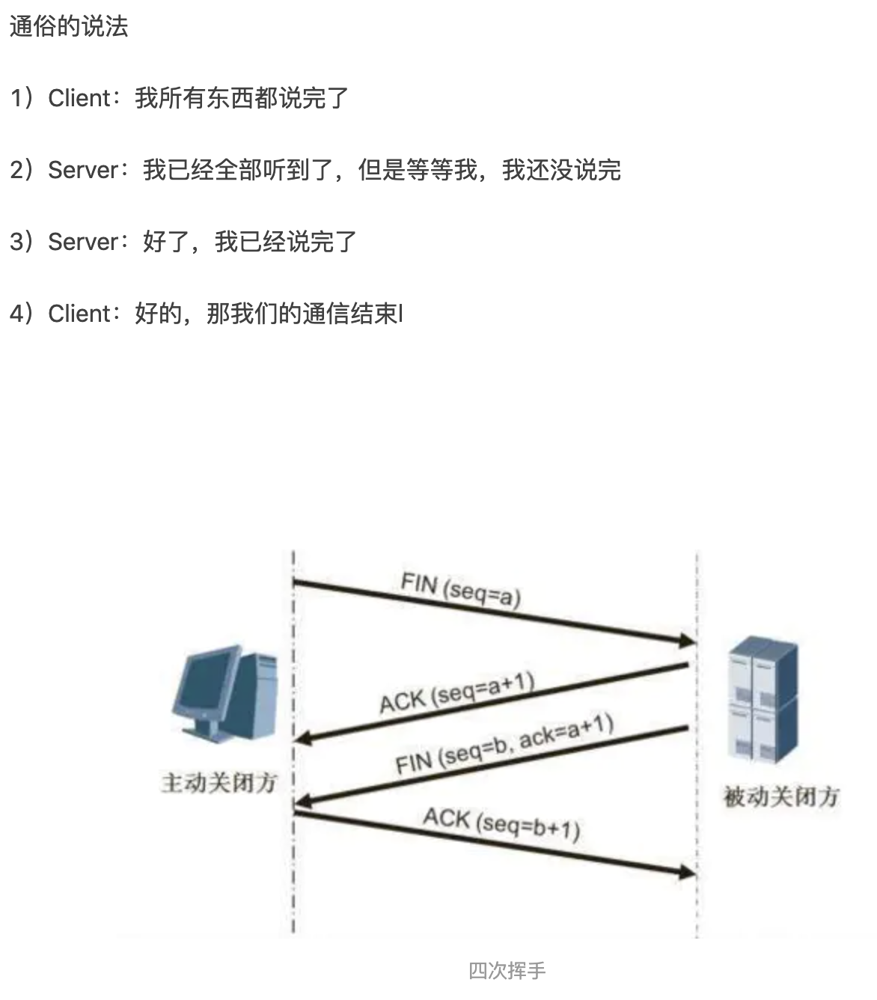
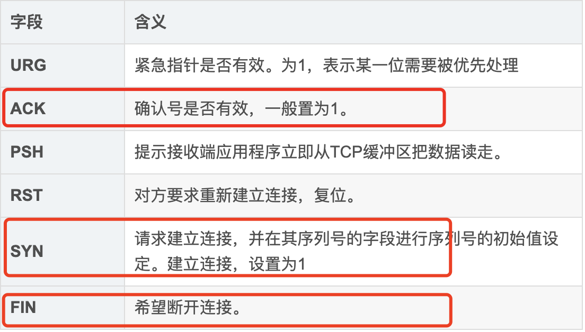

#### :question:简述常见的 HTTP 状态码的含义（301，304，401，403）

* 200: 代表成功

* 300:资源重定向。
  * 301-永久重定向，表示资源已经永久的搬到了其他的位置。302-临时重定向。
  * 304-客户端发送附带的请求时，条件不满足（返回304时，不包含任何主体）【意思就是，你请求的资源倒是有，但是你说的条件不满足啊】

* 400:  客户端问题
  * 401-表示发送的请求要有HTTP认证信息或者认证失败了。
  * 403-Forbidden。表示请求的资源禁止访问（被服务器拒绝了）

500：服务器错误  

#### HTTP有哪些方法？

1.GET：发送一个请求来获取服务器上指定URL的资源。

2.POST：传输实体主体，向服务器提交数据或附加新的数据。

3.PUT：跟POST方法一样，可以向服务器提交数据。但是它们之间也有所不同，PUT指定了资源在服务器上的位置，而POST没有。

4.HEAD：获得报文首部，和GET一样但不返回报文主体部分。

5.DELETE：按请求URL删除指定的资源。

6.POPTION：询问支持的方法，查询针对请求URL指定的资源支持的方法。

7.TARCE：追踪路径，

8.CONNECT：要求在与代理服务器通信时建立隧道，实现用隧道协议进行TCP通信。

#### HTTP是无状态的吗？需要保持状态的场景应该怎么做？

HTTP是无状态的。使用Cookie来管理Session。

1.客户端把用户ID和密码等登陆信息放入报文的实体部分，通常以POST方式将请求发送给服务器。

2.服务器会发放用以识别用户的Session ID，通过验证从客户端发送过来的登录信息进行身份验证，然后把用户的认证状态与Session ID 绑定后记录在服务器端。

3、客户端收到从服务器发送来的Session ID后，会将其作为Cookie保存在本地，下次向服务器发送请求时，浏览器会自动发送Cookie，所以Session ID也会随之发送到服务器。服务器端可以通过验证接收到的Session ID 识别用户和其认证状态。

#### :question:HTTP 中 GET 和 POST 区别

&emsp;:pencil2: A：

0、GET只能URL编码，POST支持多种编码方式。

1、GET请求的参数通过URL传送，而POST请求的数据放在Request Body（请求体）中。

2、GET请求在URL传参，会有长度限制，而POST没有这个限制。

3、GET产生的URL可以被收藏，POST不可以。

4、GET请求会被浏览器**主动缓存**，而POST不会。【重要】

5、GET请求的参数会被完整的保存在历史记录里，POST的请求不会保存。

6、浏览器在回退时，GET**不会重新请求**，但是POST会重新请求。【重要】

7、GET方式产生一个TCP数据包，POST方式产生两个TCP数据包（GET：header 和data一起发送；POST：先发送header再发送data）。 

GET方式请求浏览器会把Http  header和data 一起发送出去，服务器返回200  OK（返回数据）

POST方式请求：浏览器会先发送header，服务器返回100  continue，浏览器再发送data，服务器返回200  ok（返回数据）

### HTTPS的加密与认证过程

加密过程

HTTPS采用混合加密机制，在交换密钥环节使用公开密钥加密方式（非对称密钥加密）。交换好之后，后面的通信都使用共享密钥加密方式。（对称密钥加密）。

认证过程

1、服务器把自己的公开密钥登陆至数字证书认证机构。

2、数字认证机构用自己的私有密钥对服务器的公开密钥做数字签名，并颁发数字证书。

3、客户端拿到服务器的公钥证书后，使用数字证书认证机构的公开密钥，向数字证书认证机构进行验证，以确认服务器公开密钥的真实性。

4、客户端使用服务器的公开密钥对报文加密后发送。

5，服务器使用私有密钥对报文进行解密。

#### :question:TCP 三次握手，四次挥手。

&emsp;:pencil2: A：[图解链接](https://www.jianshu.com/p/d3725391af59)

HTTPS加密认证过程？

TCP和UDP区别？

输入URL后页面展示的过程？

简述什么是 XSS 攻击以及 CSRF 攻击？如何防止攻击？

#### :question:localstorage、sessionStorage 与 cookie 的区别是什么？

超出大小会被静默删除。

Set-Cookie：可以设置名/值。cookie的过期时间，和安全标志（secure）、域、路径。Set-Cookie的设置的这些只是用于告诉浏览器在什么情况下应该在请求中包含cookie，并不会随着请求发送给服务器。发送给服务器的只有名/值。  

#### :question:简述浏览器的渲染过程，重绘和重排在渲染过程中的哪一部分？

&emsp;:pencil2: A：1、根据HTML文件解析生成DOM树；

2、根据CSS文件解析生成CCSOM树；

3、DOM树和CSSOM结合生成render tree（渲染树）；

4、计算渲染树上的每个几点的位置；

5、根据布局进行绘制（paint），最终页面呈现。

计算---->重排，绘制--->重绘。**重绘不会影响重排，重排一定会影响重绘。**

重绘：单单改变元素的外观颜色等。

重排：改变布局，重新排列元素。

#### :question:什么情况下引起重排和重绘？改变 color 会吗？改变 margin 会吗？

&emsp;:pencil2: A:一般情况下，改变元素的颜色外观会引起重绘，改变元素的布局会一起重排。重排一定会引起重绘。

**可能会引起重排的情况：**

1、改变window的大小；

2、定位或者浮动；

3、改变盒模型（margin，padding，win 的童话，height等）；

4、添加删除样式。

**减少重绘和重排：**

1、使用translate代替top的使用。

2、用 visibility ：hidden代替display：none。因为visibility是**外观属性**，会引起重绘。后者diaplay会引起重排。

3、把DOM离线修改。先把display设置成display：none。然后离线修改DOM n 多次再把它显示出来。只重排一次。

4、动画实现的速度。动画实现的越快引起的重排次数越多。可以选择使用requestAnimationFrame。

5、CSS选择符是从右往左匹配查找，要避免DOM 树深度过深。

6、将频繁运行的动画变成图层，图层能够阻止 该元素的重排对其它元素的影响。比如video标签，浏览器会自动把该节点变成一个图层。

**很重要的一点是重绘和重排是和事件循环（Event loop）有关。**

1. 因为Event loop执行完Microtasks（微任务）后，会判断document需不需要刷新。浏览器每16ms才刷新一次。

2. 浏览器会判断有没有resize或者scroll，如果有的话就触发事件。所以resize和scroll也是至少16ms才触发一次，并且自带节流的功能。

3. 判断是否触发了 media query

4. 更新动画并且发送事件

5. 判断是否有全屏操作事件

6. 执行 requestAnimationFrame 回调

7. 执行 IntersectionObserver 回调，该方法用于判断元素是否可见，可以用于懒加载上，但是兼容性不好。

8. 更新界面

9. 以上就是一帧中可能会做的事情。如果在一帧中有空闲时间，就会去执行 requestIdleCallback 回调。

以上内容来自于 HTML 文档  

#### :question:简述浏览器的垃圾回收机制?

&emsp;:pencil2: A:  

#### :question:简述什么是 XSS 攻击以及 CSRF 攻击？如何防止攻击？(背住原理和防御方法)

#### CSRF：基本概念、攻击方式、防御措施

**1、CSRF：基本概念**

CRSF:（Cross-site Request Forgery）**跨域请求伪造**

**2、CSRF的攻击原理**

CSRF简单点说就是第三方利用网站对用户的信任，利用用户的登录状态伪造恶意的请求。

**3、CSRF如何防御**

**方式一：Token验证**

服务端下发一个随机的Token给客户端。

客户端再次发起请求的时候要携带这个Token。

服务验证这个Token是否有效。

**方式二：**

**方式三：Reference**

通过验证Reference判断是否是第三方请求。只接受本站的请求，第三方请求就拒绝。

#### XSS：基本概念、攻击方式、防御措施。

**1、XSS的基本概念**

XSS：（Cross Site Scripting）**跨域脚本攻击**

**2、攻击原理**

**3、防御原理**

### :question:输入URL  实现页面的过程?

1、输入网址。

2、DNS解析，返回IP地址。

3、浏览器和服务器进行Tcp连接（三次握手）。

4、浏览器向服务器发送HTTP请求。

5、服务器处理请求。

6、服务器返回一个HTTP响应报文。

7、浏览器根据请求回来的数据解析数据渲染页面。

8、浏览器和服务器断开链接（四次挥手）

### :question:首屏渲染优化

:pencil2:A：​

### :question:简述浏览器的缓存机制

浏览器缓存是浏览器端保存数据用于快速读取或避免重复资源请求的优化机制，有效的缓存使用可以避免重复的网络请求和浏览器快速地读取本地数据，整体上加速网页展示给用户

