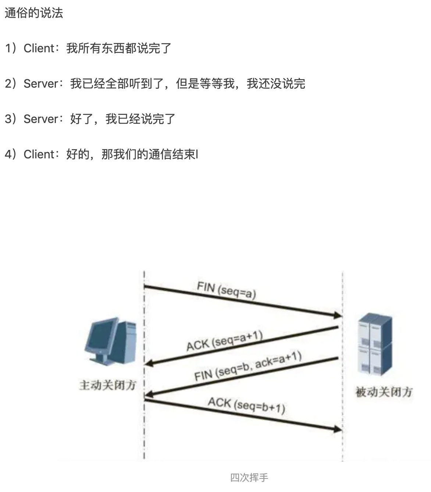

## js基础：

### ECMAScript：

:question:1. const、let、var关键字区别？

&emsp;:pencil2:A: 

- let和var的作用差不多。

区别：1.let声明的变量是块作用域，var声明的变量是函数作用域。var会有声明变量提升，let声明的变量不会在作用域中提升。2.全局声明：使用let在全局作用域声明的变量不会成为window属性（var声明的则会成为window对象的属性）

- const行为和let基本相同。唯一重要的区别是const声明变量时，必须同时初始化变量。且尝试修改const声明的变量会导致错误。

__声明的最佳实践风格就是: 不使用var。const优先，let次之__

:question:2. 简述 Javascript 的数据类型?（应该着重考察symbol）

&emsp;:pencil2:A:Number、String、Bloonean、Null、Undefined、Object和Symbol 七种数据类型

:question:3.​  Javascript 中 == 与 === 的区别是什么？

&emsp;:pencil2:A:相等（==）操作符会进行强制的类型转换。全等操作符不会，只有两个值完全相等才会返回true。相等运算符（null == undefined）为true，全等为false。【实际上undefined是null派生出来的一个对象，他俩很相似，所以相等运算符为true。对于相等运算符而言他俩是不同的数据类型】

由于相等操作符会进行类型转换，所以推荐使用全等操作符。这样有助于保持代码中数据类型的完整性。

:question:4. 数组去重有哪些方式？？手写数组去重★★★

:pencil2:A:1.使用ES6的new Set()方法；

 ```javascript
let newA = Array.from(new Set(arr));
 ```

2.对数组先进行sort排序，然后遍历数组，对数组去重。

```javascript
function unique(arr){
	let newArr = arr.concat().sort();
  let res = [newArr[0]];
  for(let i =1;i<newArr.length;++i){
    if(newArr[i] !== newArr[i-1]){
      res.push(newArr[i]);
    }
  }
  return res;
}
```

3.使用两层for循环结合splice()方法。

4.includes方法。可以判断有NaN是true。+0，-0，0都视为一样的0。

:question:5.  数组拍平？

```javascript
function flatten(arr){
  let res = [];
  for(let i = 0;i < arr.length;++i){
    if(Array.isArray(arr[i])){
      arr = arr.concat(arr[i])
    }else{
      res.push(arr[i])
    }
  }
  return res;
}//使用Array.isArray(ele)方法判断
//如果知道数组的维数，可以使用ES6方法 arr.flat(num/Infinity)
```


:question:6. 简述 Javascript 原型以及原型链

&emsp;:pencil2:A:一个对象在创建的时候都会在其内部初始化一个属性，就是prototype（原型）。

当我们访问对象属性的时候，首先会在这个对象的内部进行查找，如果找不到就会到它的原型上查找，它的原型还会有自己的原型，就这样一级一级查找下去就形成了原型链。


:question:7. 简述 Javascript 中 this 的指向有哪些？

* 以函数调用的时候，this指向window。

* 以方法调用的时候，this指向调用它的对象。

* 以关键词new创建的构造函数，如果返回值是对象就指向返回值，否值指向创建的对象。

* 使用call/apply调用时，this是指定的那个对象。


:question:8. 箭头函数和普通函数的区别是什么？

&emsp;:pencil2:A:0.箭头函数语法更简洁、清晰；1.箭头函数没有this，它的this指向其上下文的this；2.箭头函数不能使用arguments、super和new.target，也不能用作构造函数。3.箭头函数没有prototype属性。


:question:9. 什么是闭包，什么是立即执行函数，它的作用是什么？简单说一下闭包的使用场景？

&emsp;:pencil2:A:函数A返回一个函数B，函数B中使用了函数A变量，函数B就是闭包。

立即执行函数:__声明一个匿名函数并马上调用它。__作用就是创建一个独立的作用域。可以解决闭包内存泄漏的问题。

闭包使用场景：1.可以用闭包实现公共方法，访问位于包含作用域中的变量。

2.可以访问私有变量的公共方法（特权方法）。

_不是十分必要的情况下避免使用闭包。因为作用域一直不释放，无法进行垃圾回收，过度占用内存_


:question:10. JavaScript 中的严格模式是什么，有什么作用？

&emsp;:pencil2:A:严格模式：是采用具有限制性JavaScript变体的一种方式，从而使代码脱离了“稀松懒散”的模式。

1.严格模式通过__抛出错误__消除一些原有的__静默错误__。

2.严格模式修复了一些导致JavaScript引擎难以执行优化的缺陷：有时候相同的代码，严格模式比非严格模式运行的更快。

3.严格模式__禁用了__在ECMAScript未来版本中可能会定义的一些语法。


:question:11.作用域链？

&emsp;:pencil2:A:内部函数访问外部函数的变量，采用的是链式查找的方式来决定取哪个值。这种结构称之为作用域链。

全局函数无法访问局部函数的内部细节，但是局部函数可以访问其上层函数的细节，直至全局细节。


### DOM：


### BOM:

:question:1..Javascript 可以保存的最大数值是多少

&emsp;:pencil2:A:js可以表示的最大数值保存在number.MAX_VALUE中，可以表示的最小数值保存在number.MIN_VALUE中

 number.MAX_VALUE :1.797e+308

number.MIN_VALUE:5e-324;  


:question:localstorage、sessionStorage 与 cookie 的区别是什么？


超出大小会被静默删除。

Set-Cookie：可以设置名/值。cookie的过期时间，和安全标志（secure）、域、路径。Set-Cookie的设置的这些只是用于告诉浏览器在什么情况下应该在请求中包含cookie，并不会随着请求发送给服务器。发送给服务器的只有名/值。  


:question:简述常见的 HTTP 状态码的含义（301，304，401，403）&emsp;:pencil2: A：

* 200: 代表成功

* 300:资源重定向。
  * 301-永久重定向，表示资源已经永久的搬到了其他的位置。302-临时重定向。
  * 304-客户端发送附带的请求时，条件不满足（返回304时，不包含任何主体）【意思就是，你请求的资源倒是有，但是你说的条件不满足啊】

* 400:  客户端问题
  * 401-表示发送的请求要有HTTP认证信息或者认证失败了。
  * 403-Forbidden。表示请求的资源禁止访问（被服务器拒绝了）

500：服务器错误  

:question:HTTP 中 GET 和 POST 区别

&emsp;:pencil2: A：GET和POST本质上无差异，都是HTTP发送请求数据的的方法。都是TCP/IP链接。[链接](https://www.oschina.net/news/77354/http-get-post-different)

GET方式请求浏览器会把Http  header和data 一起发送出去，服务器返回200  OK（返回数据）

POST方式请求：浏览器会先发送header，服务器返回100  continue，浏览器再发送data，服务器返回200  ok（返回数据）

总结就是：GET方式产生一个TCP数据包，POST方式产生两个数据包。

* 由于POST需要验证两次，时间上消耗的多一点，看起来GET比POST效率高。**但实际上网络好**的情况两种方式消耗的时间差别基本可以无视。**网络差的情况**，两次Tcp验证数据包， 在完整性上有非常大的优点。
* 并不是所有浏览器都会在POST中发送两次包，FireFox只发送一次。  
  

:question:TCP 三次握手，四次挥手。

&emsp;:pencil2: A：[图解链接](https://www.jianshu.com/p/d3725391af59)




:question:简述 jsonp 的工作原理

&emsp;:pencil2:A：**jsonp其实就是利用了<scritp>标签没有跨域限制的漏洞，来达到与第三方通讯的目的。**在有需要通讯的时候，就创建一个<scritp>元素，地址指向第三方API网址，形如：<script src="http://www.example.net/api?param1=1&param2=2"></script>；然后把请求回来的数据回调函数中处理。  

```javascript
//代码实现
let newScript = document.createElement('script');
newScript.src = 'https://www.abd.com?callback=fn()';
document.body.appendchild(newScript);
function fn(data){
  console.log(data)
}
```


:question:什么是跨域，什么情况下会发生跨域请求？

&emsp;:pencil2: A：跨域就是从一个域向另一个域请求的时候，由于受到浏览器同源策略的限制，就需要跨域。（同源策略：协议、域名、端口号相同）

解决办法：

1.禁用浏览器的同源策略。

2.jsonp跨域：

3.从代理入手：不在浏览器请求，从同项目的后台进行请求，再把请求结果返回给前台。（因为只有浏览器有同源策略）

4.从CORS入手：后台的请求响应头告诉浏览器**“我这个请求很安全，允许当前域名跨域访问”**。实现：利用CORS（Cross-Origin-Resource Sharing，跨资源共享），W3C的一个标准，浏览器检测到这个响应头的一些字段值后，就会跳过同源策略。例如：res.header("Access-Control-Allow-Origin", "*"); //允许全部域名跨域，可以指定特点域名，逗号分隔    

:question:readyState 的不同返回值有什么区别？&emsp;:pencil2: A：


XMLHttpRequest.open()方法初始化一个请求。

XMLHttpRequest.send()方法用于发送HTTP请求。

AJAX的核心是XMLHttpRequest对象，在AJAX执行过程中，readyState的值从0开始变化，当AJAX运行到send方法调用时，发送HTTP请求，HTTP请求安装步骤执行，此时status的值开始发生变化，AJAX运行机制等待HTTP请求返回结果。最后，当HTTP请求返回结果后，无论HTTP请求成功还是失败、也不管是否请求到正确信息，AJAX的运行机制都会继续执行，直到完成运行或者出错为止。  


:question:简述浏览器的渲染过程，重绘和重排在渲染过程中的哪一部分？

&emsp;:pencil2: A：1、根据HTML文件解析生成DOM树；

2、根据CSS文件解析生成CCSOM树；

3、DOM树和CSSOM结合生成render tree（渲染树）；

4、计算渲染树上的每个几点的位置；

5、根据布局进行绘制（paint），最终页面呈现。

计算---->重排，绘制--->重绘。**重绘不会影响重排，重排一定会影响重绘。**

重绘：单单改变元素的外观颜色等。

重排：改变布局，重新排列元素。


:question:什么情况下引起重排和重绘？改变 color 会吗？改变 margin 会吗？

&emsp;:pencil2: A:一般情况下，改变元素的颜色外观会引起重绘，改变元素的布局会一起重排。重排一定会引起重绘。

**可能会引起重排的情况：**

<span style="color:deeppink">1、改变window的大小；</span>

<span style="color:deeppink">2、定位或者浮动；</span>

<span style="color:deeppink">3、改变盒模型（margin，padding，win 的童话，height等）；</span>

<span style="color:deeppink">4、添加删除样式。</span>


**减少重绘和重排：**

1、使用translate代替top的使用。

2、用 visibility ：hidden代替display：none。因为visibility是**外观属性**，会引起重绘。后者diaplay会引起重排。

3、把DOM离线修改。先把display设置成display：none。然后离线修改DOM n 多次再把它显示出来。只重排一次。

4、动画实现的速度。动画实现的越快引起的重排次数越多。可以选择使用requestAnimationFrame。

5、CSS选择符是从右往左匹配查找，要避免DOM 树深度过深。

6、将频繁运行的动画变成图层，图层能够阻止 该元素的重排对其它元素的影响。比如video标签，浏览器会自动把该节点变成一个图层。


**很重要的一点是重绘和重排是和事件循环（Event loop）有关。**

1. 因为Event loop执行完Microtasks（微任务）后，会判断document需不需要刷新。浏览器每16ms才刷新一次。

2. 浏览器会判断有没有resize或者scroll，如果有的话就触发事件。所以resize和scroll也是至少16ms才触发一次，并且自带节流的功能。

3. 判断是否触发了 media query

4. 更新动画并且发送事件

5. 判断是否有全屏操作事件

6. 执行 requestAnimationFrame 回调

7. 执行 IntersectionObserver 回调，该方法用于判断元素是否可见，可以用于懒加载上，但是兼容性不好。

8. 更新界面

9. 以上就是一帧中可能会做的事情。如果在一帧中有空闲时间，就会去执行 requestIdleCallback 回调。

以上内容来自于 HTML 文档  


:question:2.简述浏览器的垃圾回收机制?

&emsp;:pencil2: A:  